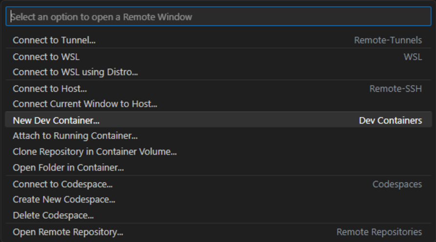
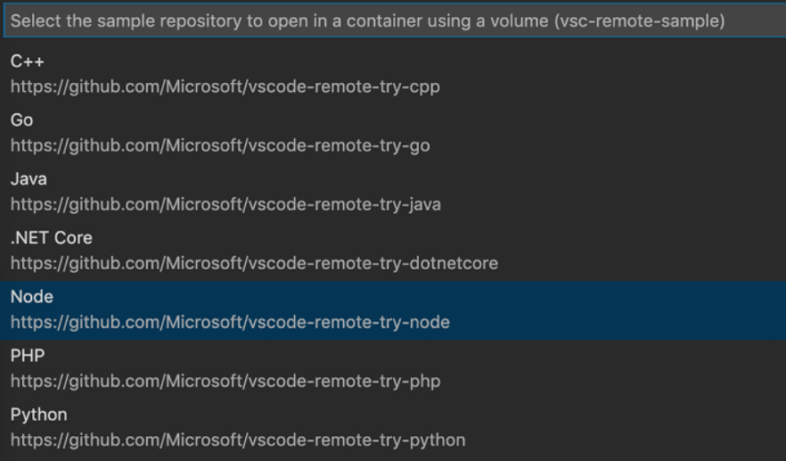
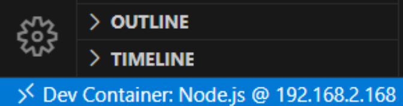

# 3. Create a Development Container

The easiest way to get started is to try one of the sample development containers. The Remote Status bar item can quickly show you in which context VS Code is running (local or remote) and clicking on the item will bring up the Dev Containers commands.

To create a Docker container, we are going to open a GitHub repository with a `Node.js` project. Open the Command Palette (F1) to run the command Dev Containers: Try a Dev Container Sampleand select the Node sample from the list.

The window will then reload, but since the container does not exist yet, VS Code will create one and clone the sample repository into an isolated container volume. This may take some time, and a progress notification will provide status updates. Fortunately, this step isn't necessary the next time you open the folder since the container will already exist.

After the container is built, VS Code automatically connects to it and maps the project folder from your local file system into the container. Once the container is running and you're connected, you should see your remote context change in the bottom left of the Status bar:

