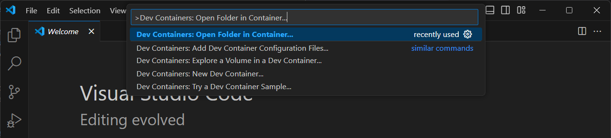
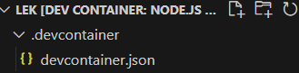

# 5. Create a Folder for Your Project

Once you have established an SSH connection with your Linux host in VS Code, open up the terminal by Use the code below to create a directory for your dev container:

```
mkdir my-dev-container
cd my-dev-container
```

In VS Code, hit Ctrl + Shift + P to open up the Command Palette. Insert "Dev Containers: Open Folder in Container..." and hit Enter. You will be prompted to select a folder to open the container. Select the folder you have just created: my-dev-container.



Now, you will need to configure your Docker Container, select Add configuration to workspace > "Node.js & JavaScript" > "20-bookworm" and click "OK".



You have successfully created a Dev Container. Now, you can start developing inside this isolated environment with all the neccessary tools and dependencies.