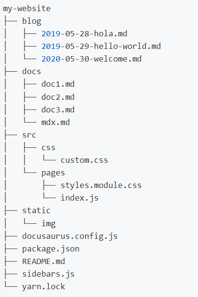

# 2. Create a Docusaurus Site

The easiest way to install Docusaurus is to use the command line tool that helps you scaffold a skeleton Docusaurus website. You can run this command anywhere in a new empty repository or within an existing repository, it will create a new directory containing the scaffolded files.

Inside the container's terminal in VS Code, navigate to your project folder. Install Node.js and create a new Docusaurus site by running the following commands:

```
npx create-docusaurus@latest my-website classic
```

:memo: **Note** 

When prompted to select a language, please selct JavaScript.

Assuming you choose the classic template and named your site my-website, you will see the following files generated under a new directory my-website/:



- /blog/ - Contains the blog Markdown files. You can delete the directory if you've disabled the blog plugin, or you can change its name after setting the path option. More details can be found in the blog guide
- /docs/ - Contains the Markdown files for the docs. Customize the order of the docs sidebar in sidebars.js. You can delete the directory if you've disabled the docs plugin, or you can change its name after setting the path option. More details can be found in the docs guide
- /src/ - Non-documentation files like pages or custom React components. You don't have to strictly put your non-documentation files here, but putting them under a centralized directory makes it easier to specify in case you need to do some sort of linting/processing
- /src/pages - Any JSX/TSX/MDX file within this directory will be converted into a website page. More details can be found in the pages guide
- /static/ - Static directory. Any contents inside here will be copied into the root of the final build directory
- /docusaurus.config.js - A config file containing the site configuration. This is the equivalent of siteConfig.js in Docusaurus v1
- /package.json - A Docusaurus website is a React app. You can install and use any npm packages you like in them
- /sidebars.js - Used by the documentation to specify the order of documents in the sidebarFP