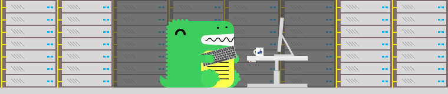

# 1. Overview

Docusaurus is a static-site generator. It builds a single-page application with fast client-side navigation, leveraging the full power of React to make your site interactive. It provides out-of-the-box documentation features but can be used to create any kind of site (personal website, product, blog, marketing landing pages, etc).

Before you start please make sure your `Node.js` version 18.0 or above (which can be checked by running node -v). You can use nvm for managing multiple Node versions on a single machine installed.