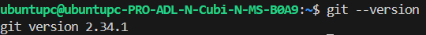

# 2. Install Git on Windows

Git is an open source version control application. You will need Git installed for this class.

Please Install: [Git](https://git-scm.com/)

You may already have Git installed so let's check! Once the command output has been completed, you can verify the installation by typing:

```
$ git --version
```

You should see something like this:



Anything over 2.0 will work for this class!

If not, please install by running:

```
sudo apt install git
```
