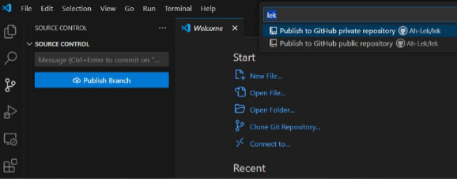
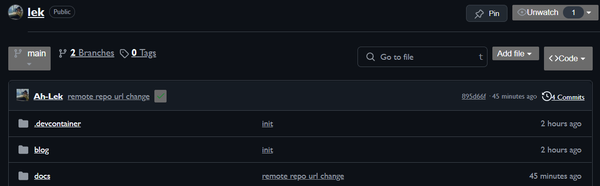

# 6.  Publish to GitHub

Next, select "Publish Branch" and depending on your preference, publish privately or publicly. We would like to select the public repository in order us to deploy our document.

Now, you will be able to see your files on your GitHub repository.

