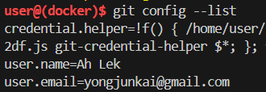

# 3. Set Up and Configure Your GitHub Account

To get started with GitHub, you'll need to create a free personal account and verify your email address.

Please Install: [GitHub](https://github.com/)

Next, you need to configure your Github in your Visual studio. 

Set your username:

```
git config --global user.name "Your Name"
```

Set your email:

```
git config --global user.email "youremail@example.com"
```

Confirm the configuration:

```
git config --list
```

If the configuration is successful, your username and email will be shown like this:

