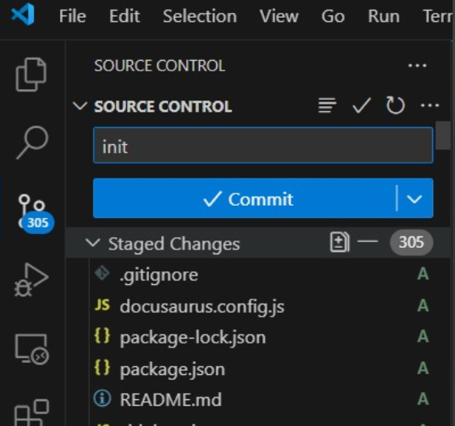

# 5. Stage and Commit Changes

After the initialization, you may start editing your contents. After edit your folder, you may to publish to Github. Then, go to stage and commit your changes in "Source Control".

