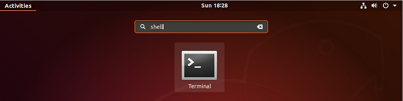
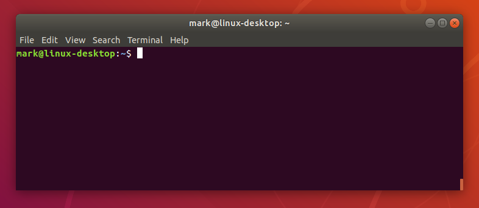
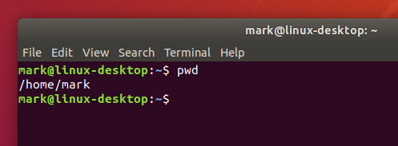

# 4. Open a Terminal

On a Ubuntu 20.04 system you can find a launcher for the terminal by clicking on the Activities item at the top left of the screen, then typing the first few letters of “terminal”, “command”, “prompt” or “shell”. Yes, the developers have set up the launcher with all the most common synonyms, so you should have no problems finding it.



Other versions of Linux, or other flavours of Ubuntu, will usually have a terminal launcher located in the same place as your other application launchers. It might be hidden away in a submenu or you might have to search for it from within your launcher, but it’s likely to be there somewhere.

If you can’t find a launcher, or if you just want a faster way to bring up the terminal, most Linux systems use the same default keyboard shortcut to start it: **Ctrl-Alt-T**.

However you launch your terminal, you should end up with a rather dull looking window with an odd bit of text at the top, much like the image below. Depending on your Linux system the colours may not be the same, and the text will likely say something different, but the general layout of a window with a large (mostly empty) text area should be similar.



Let’s run our first command. Click the mouse into the window to make sure that’s where your keystrokes will go, then type the following command, **all in lower case**, before pressing the **Enter** or **Return** key to run it.

```
pwd
```

You should see a directory path printed out (probably something like /home/YOUR_USERNAME), then another copy of that odd bit of text.



There are a couple of basics to understand here, before we get into the detail of what the command actually did. First is that when you type a command it appears on the same line as the odd text. That text is there to tell you the computer is ready to accept a command, it’s the computer’s way of prompting you. In fact it’s usually referred to as the prompt, and you might sometimes see instructions that say “bring up a prompt”, “open a command prompt”, “at the bash prompt” or similar. They’re all just different ways of asking you to open a terminal to get to a shell.

On the subject of synonyms, another way of looking at the prompt is to say that there’s a line in the terminal into which you type commands. A command line, if you will. Again, if you see mention of “command line”, including in the title of this very tutorial, it’s just another way of talking about a shell running in a terminal.

The second thing to understand is that when you run a command any output it produces will usually be printed directly in the terminal, then you’ll be shown another prompt once it’s finished. Some commands can output a lot of text, others will operate silently and won’t output anything at all. Don’t be alarmed if you run a command and another prompt immediately appears, as that usually means the command succeeded. If you think back to the slow network connections of our 1970s terminals, those early programmers decided that if everything went okay they may as well save a few precious bytes of data transfer by not saying anything at all.

A sense of location
Now to the command itself. **pwd** is an abbreviation of ‘print working directory’. All it does is print out the shell’s current working directory. But what’s a working directory?

One important concept to understand is that the shell has a notion of a default location in which any file operations will take place. This is its working directory. If you try to create new files or directories, view existing files, or even delete them, the shell will assume you’re looking for them in the current working directory unless you take steps to specify otherwise. So it’s quite important to keep an idea of what directory the shell is “in” at any given time, after all, deleting files from the wrong directory could be disastrous. If you’re ever in any doubt, the pwd command will tell you exactly what the current working directory is.

You can change the working directory using the **cd** command, an abbreviation for ‘change directory’. Try typing the following:

```
cd /
pwd
```

Now your working directory is “/”. If you’re coming from a Windows background you’re probably used to each drive having its own letter, with your main hard drive typically being “C:”. Unix-like systems don’t split up the drives like that. Instead they have a single unified file system, and individual drives can be attached (“mounted”) to whatever location in the file system makes most sense. The “/” directory, often referred to as the root directory, is the base of that unified file system. From there everything else branches out to form a tree of directories and subdirectories.

From the root directory, the following command will move you into the “home” directory (which is an immediate subdirectory of “/”):

```
cd home
pwd
```

To go up to the parent directory, in this case back to “/”, use the special syntax of two dots (..) when changing directory (note the space between cd and .., unlike in DOS you can’t just type cd.. as one command):

```
cd ..
pwd
```

Typing cd on its own is a quick shortcut to get back to your home directory:

```
cd
pwd
```

You can also use .. more than once if you have to move up through multiple levels of parent directories:

```
cd ../..
pwd
```

Notice that in the previous example we described a route to take through the directories. The path we used means “starting from the working directory, move to the parent / from that new location move to the parent again”. So if we wanted to go straight from our home directory to the “etc” directory (which is directly inside the root of the file system), we could use this approach:

```
cd
pwd

cd ../../etc
pwd
```

Most of the examples we’ve looked at so far use relative paths. That is, the place you end up at depends on your current working directory. Consider trying to cd into the “etc” folder. If you’re already in the root directory that will work fine:

```
cd /
pwd
cd etc
pwd
```

But what if you’re in your home directory?

```
cd
pwd
cd etc
pwd
```

You’ll see an error saying “No such file or directory” before you even get to run the last pwd. Changing directory by specifying the directory name, or using .. will have different effects depending on where you start from. The path only makes sense relative to your working directory.

But we have seen two commands that are absolute. No matter what your current working directory is, they’ll have the same effect. The first is when you run cd on its own to go straight to your home directory. The second is when you used cd / to switch to the root directory. In fact any path that starts with a forward slash is an absolute path. You can think of it as saying “switch to the root directory, then follow the route from there”. That gives us a much easier way to switch to the etc directory, no matter where we currently are in the file system:

```
cd
pwd
cd /etc
pwd
```

It also gives us another way to get back to your home directory, and even to the folders within it. Suppose you want to go straight to your “Desktop” folder from anywhere on the disk (note the upper-case “D”). In the following command you’ll need to replace USERNAME with your own username, the whoami command will remind you of your username, in case you’re not sure:

```
whoami
cd /home/USERNAME/Desktop
pwd
```

There’s one other handy shortcut which works as an absolute path. As you’ve seen, using “/” at the start of your path means “starting from the root directory”. Using the tilde character (“~”) at the start of your path similarly means “starting from my home directory”.

```
cd ~
pwd

cd ~/Desktop
pwd
```

Now that odd text in the prompt might make a bit of sense. Have you noticed it changing as you move around the file system? On a Ubuntu system it shows your username, your computer’s network name and the current working directory. But if you’re somewhere inside your home directory, it will use “~” as an abbreviation. Let’s wander around the file system a little, and keep an eye on the prompt as you do so:

```
cd
cd /
cd ~/Desktop
cd /etc
cd /var/log
cd ..
cd
```

You must be bored with just moving around the file system by now, but a good understanding of absolute and relative paths will be invaluable as we move on to create some new folders and files!

