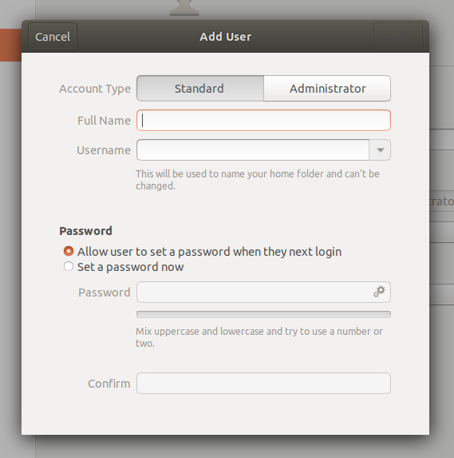
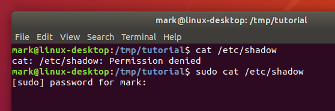
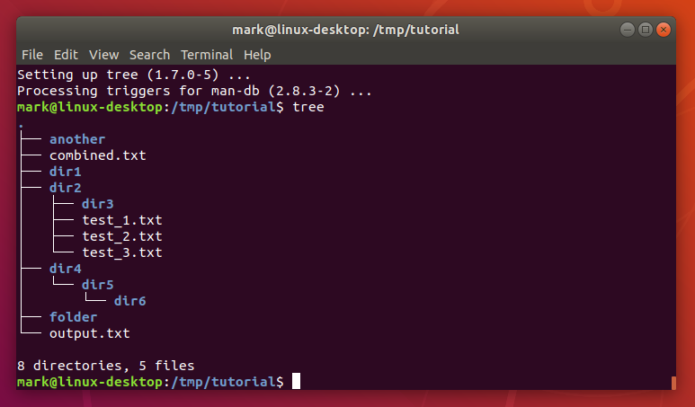

# 8. The Command Line and the Superuser

One good reason for learning some command line basics is that instructions online will often favour the use of shell commands over a graphical interface. Where those instructions require changes to your machine that go beyond modifying a few files in your home directory, you’ll inevitably be faced with commands that need to be run as the machine’s administrator (or **superuser** in Unix parlance). Before you start running arbitrary commands you find in some dark corner of the internet, it’s worth understanding the implications of running as an administrator, and how to spot those instructions that require it, so you can better gauge whether they’re safe to run or not.

The superuser is, as the name suggests, a user with super powers. In older systems it was a real user, with a real username (almost always “**root**”) that you could log in as if you had the password. As for those super powers: root can modify or delete any file in any directory on the system, regardless of who owns them; root can rewrite firewall rules or start network services that could potentially open the machine up to an attack; root can shutdown the machine even if other people are still using it. In short, root can do just about anything, skipping easily round the safeguards that are usually put in place to stop users from overstepping their bounds.

Of course a person logged in as root is just as capable of making mistakes as anyone else. The annals of computing history are filled with tales of a mistyped command deleting the entire file system or killing a vital server. Then there’s the possibility of a malicious attack: if a user is logged in as root and leaves their desk then it’s not too tricky for a disgruntled colleague to hop on their machine and wreak havoc. Despite that, human nature being what it is, many administrators over the years have been guilty of using root as their main, or only, account.

In an effort to reduce these problems many Linux distributions started to encourage the use of the `su` command. This is variously described as being short for ‘superuser’ or ‘switch user’, and allows you to change to another user on the machine without having to log out and in again. When used with no arguments it assumes you want to change to the root user (hence the first interpretation of the name), but you can pass a username to it in order to switch to a specific user account (the second interpretation). By encouraging use of `su` the aim was to persuade administrators to spend most of their time using a normal account, only switch to the superuser account when they needed to, and then use the `logout` command (or Ctrl-D shortcut) as soon as possible to return to their user-level account.

By minimising the amount of time spent logged in as root, the use of su reduces the window of opportunity in which to make a catastrophic mistake. Despite that, human nature being what it is, many administrators have been guilty of leaving long-running terminals open in which they’ve used su to switch to the root account. In that respect su was only a small step forward for security.

When using su your entire terminal session is switched to the other user. Commands that don’t need root access, something as mundane as pwd or ls, would be run under the auspices of the superuser, increasing the risk of a bug in the program causing major problems. Worse still, if you lose track of which user you’re currently operating as, you might issue a command that is fairly benign when run as a user, but which could destroy the entire system if run as root.

Better to disable the root account entirely and then, instead of allowing long-lived terminal sessions with dangerous powers, require the user to specifically request superuser rights on a per-command basis. The key to this approach is a command called sudo (as in “switch user and do this command”).

sudo is used to prefix a command that has to be run with superuser privileges. A configuration file is used to define which users can use sudo, and which commands they can run. When running a command like this, the user is prompted for their own password, which is then cached for a period of time (defaulting to 15 minutes), so if they need to run multiple superuser-level commands they don’t keep getting continually asked to type it in.

On a Ubuntu system the first user created when the system is installed is considered to be the superuser. When adding a new user there is an option to create them as an administrator, in which case they will also be able to run superuser commands with sudo. In this screenshot of Ubuntu 18.04 you can see the option at the top of the dialog:



Assuming you’re on a Linux system that uses sudo, and your account is configured as an administrator, try the following to see what happens when you try to access a file that is considered sensitive (it contains encrypted passwords):

```
cat /etc/shadow
sudo cat /etc/shadow
Using sudo
```



If you enter your password when prompted you should see the contents of the /etc/shadow file. Now clear the terminal by running the reset command, and run sudo cat /etc/shadow again. This time the file will be displayed without prompting you for a password, as it’s still in the cache.

For instructions targeting Ubuntu, a common appearance of sudo is to install new software onto your system using the apt or apt-get commands. If the instructions require you to first add a new software repository to your system, using the apt-add-repository command, by editing files in /etc/apt, or by using a “PPA” (Personal Package Archive), you should be careful as these sources are not curated by Canonical. But often the instructions just require you to install software from the standard repositories, which should be safe.

Let’s install a new command line program from the standard Ubuntu repositories to illustrate this use of sudo:

```
sudo apt install tree
```

Once you’ve provided your password the apt program will print out quite a few lines of text to tell you what it’s doing. The tree program is only small, so it shouldn’t take more than a minute or two to download and install for most users. Once you are returned to the normal command line prompt, the program is installed and ready to use. Let’s run it to get a better overview of what our collection of files and folders looks like:

```
cd /tmp/tutorial
tree
```



Going back to the command that actually installed the new program (`sudo apt install tree`) it looks slightly different to those you’ve see so far. In practice it works like this:

1. The sudo command, when used without any options, will assume that the first parameter is a command for it to run with superuser privileges. Any other parameters will be passed directly to the new command. sudo’s switches all start with one or two hyphens and must immediately follow the sudo command, so there can be no confusion about whether the second parameter on the line is a command or an option.

2. The command in this case is apt. Unlike the other commands we’ve seen, this isn’t working directly with files. Instead it expects its first parameter to be an instruction to perform (install), with the rest of the parameters varying based on the instruction.

3. In this case the install command tells apt that the remainder of the command line will consist of one or more package names to install from the system’s software repositories. Usually this will add new software to the machine, but packages could be any collection of files that need to be installed to particular locations, such as fonts or desktop images.

You can put sudo in front of any command to run it as a superuser, but there’s rarely any need to. Even system configuration files can often be viewed (with cat or less) as a normal user, and only require root privileges if you need to edit them.

In this section you’ve learnt about the dangers of the root account, and how modern Linux systems like Ubuntu try to reduce the risk of danger by using sudo. But any use of superuser powers should be considered carefully. When following instructions you find online you should now be in a better position to spot those commands that might require greater scrutiny.