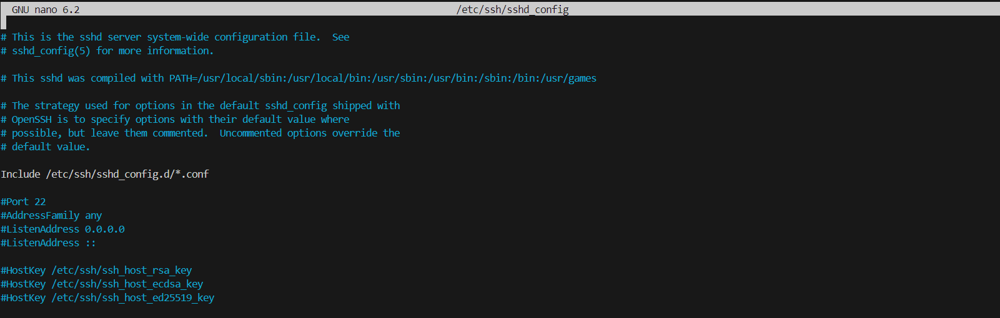

# 3. Configure OpenSSH

To configure the default behavior of the OpenSSH server application, sshd, edit the file /etc/ssh/sshd_config. For information about the configuration directives used in this file, refer to the online manpage or run man sshd_config at a terminal prompt.

There are many directives in the sshd configuration file, which control things like communication settings and authentication modes. The following are examples of configuration directives that can be changed by editing the /etc/ssh/sshd_config file.

`sudo nano /etc/ssh/sshd_config`

