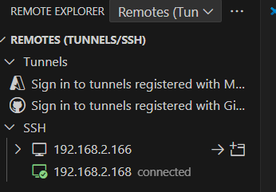
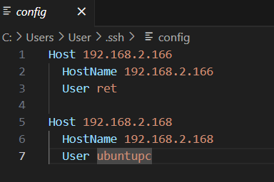

# 7. Connect to the Server

Please connect to the server using ssh:

`ssh <username>@<server-ip>`

* username: The name of the user on the host machine.
* remotehost_ip: The IP address of the host machine. You can find this in the Wi-Fi settings.

The last step, please check the ssh configuration file, it will show the UserName and HostName.

:memo: **Note** 

* Check the username using `whoami`
* Check the server ip address using `ip a`
