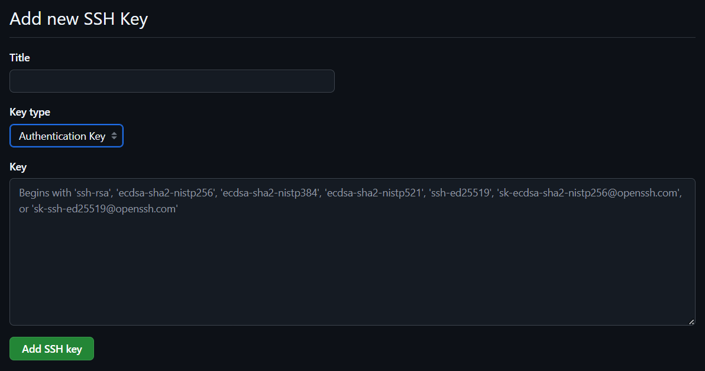

# 6. Import Keys from Githubub

These days many users have already SSH keys registered with services like GitHub. You may also register your SSH keys with services like GitHub. To export your keys, open the following file:

`~/.ssh/id_rsa.pub`

Next, go to your GitHub settings, select "SSH and GPG keys", and click "New SSH key. 

Paste your copied SSH key into the "Key" field and provide a title that is easily identifiable for you. Select "Authentication Key" as the key type.

On your host machine, enter the following command in your terminal:

`ssh-import-id-gh <github-username>`

* The alternative `gh`: will make the tool fetch from GitHub instead.

