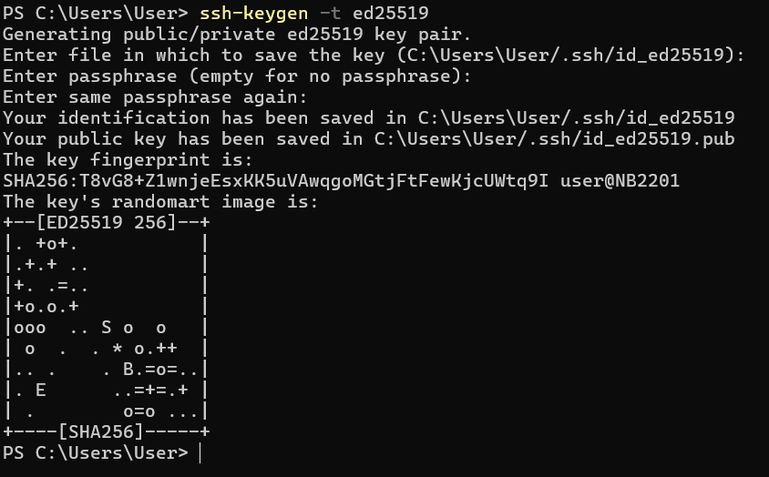
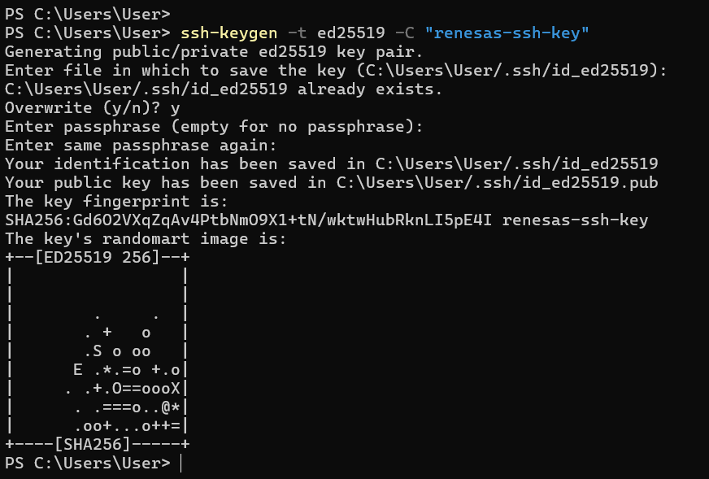

# 5. SSH keys

SSH allows authentication between two hosts without the need of a password. SSH key authentication uses a **private key** and a **public key**.

To generate the keys, run the following command:

`ssh-keygen -t rsa`

This will generate the keys using the RSA Algorithm. At the time of this writing, the generated keys will have 3072 bits. You can modify the number of bits by using the -b option. For example, to generate keys with 4096 bits, you can use:

`ssh-keygen -t rsa -b 4096`

During the process you will be prompted for a password. Simply hit `Enter` when prompted to create the key. By default, the public key is saved in the file ~/.ssh/id_rsa.pub, while ~/.ssh/id_rsa is the private key. Now copy the id_rsa.pub file to the remote host and append it to ~/.ssh/authorized_keys by running:

`ssh-copy-id username@remotehost`

* username: The name of the user on the host machine.
* remotehost_ip: The IP address of the host machine. You can find this in the Wi-Fi settings.

You can also add comment to the key.

`ssh-keygen -t ed25519 -C "renesas-ssh-key`

