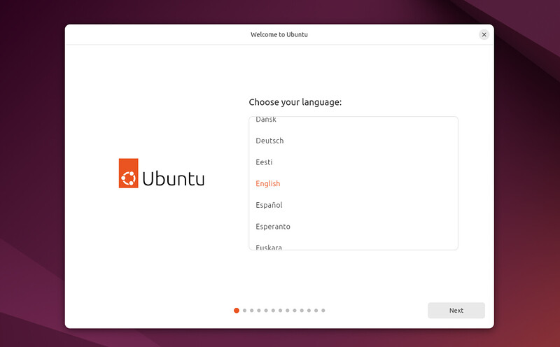
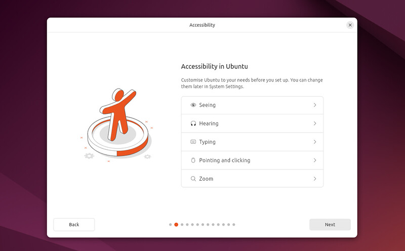
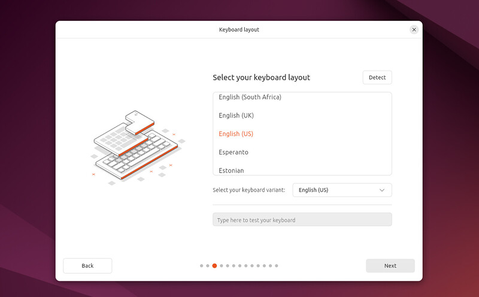
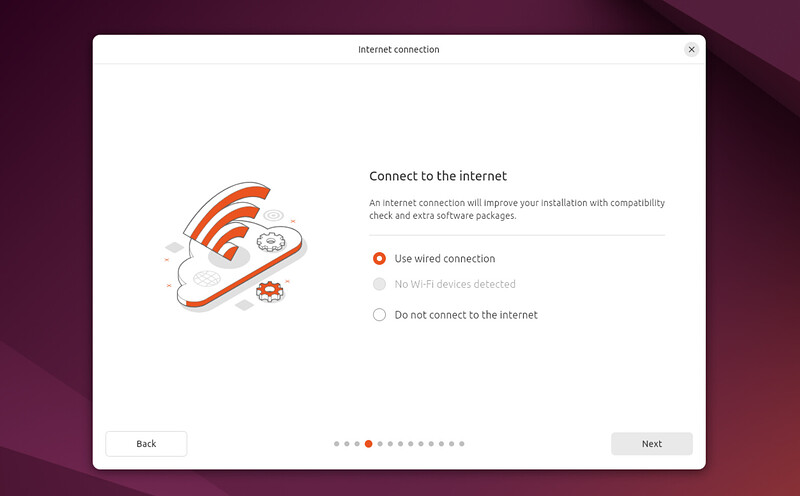
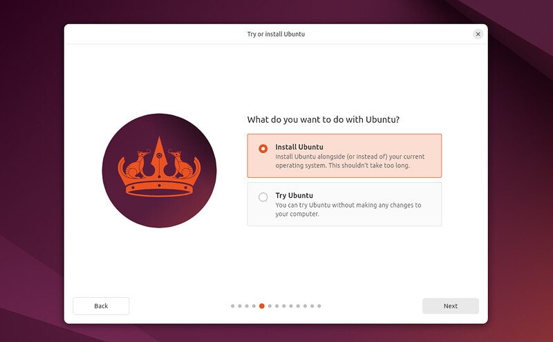

# 4. Boot from USB Flash Drive

Insert the USB flash drive into the laptop or PC you want to use to install Ubuntu and boot or restart the device. It should recognise the installation media automatically. If not, try holding F12 during startup and selecting the USB device from the system-specific boot menu.

*-MSI Cubi N ADL-018BTW*

Once the installer has initialised you will be invited to choose your language.

And then presented with the option to select any accessibility settings your require.

Your keyboard layout.

A connect to your network. This will allow Ubuntu to download updates and third party drivers (such as NVIDIA graphics drivers) during installation.

You are then offered the choice to try or install Ubuntu.

