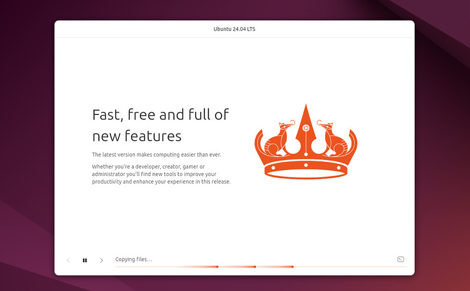
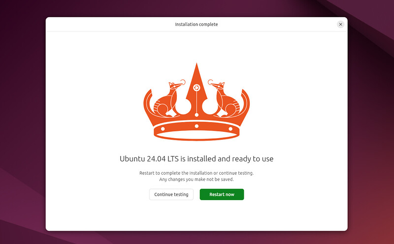
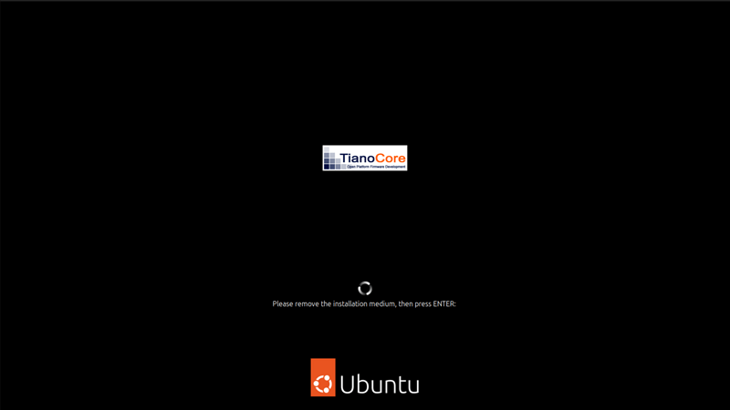
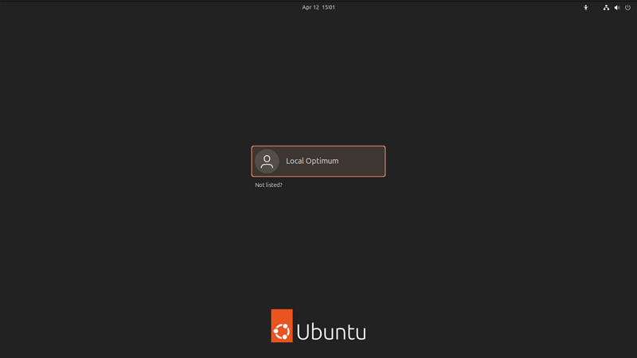
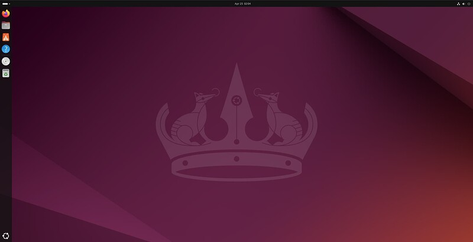

# 10. Complete the Installation

Sit back and enjoy the slideshow as Ubuntu installs in the background!

Alternatively you can see a detailed output of the installation process by clicking the icon in the bottom right corner of the window.

Once the installation has completed, you will be prompted to restart your machine. Click **Restart Now**.

When you restart, you will be prompted to remove your USB flash drive from the device. Once you’ve done this, press **ENTER**.

Enter your encryption password if you created one.

This is then followed by the login screen, where you can enter your username and password.

And that’s it, welcome to your new Ubuntu Desktop!

