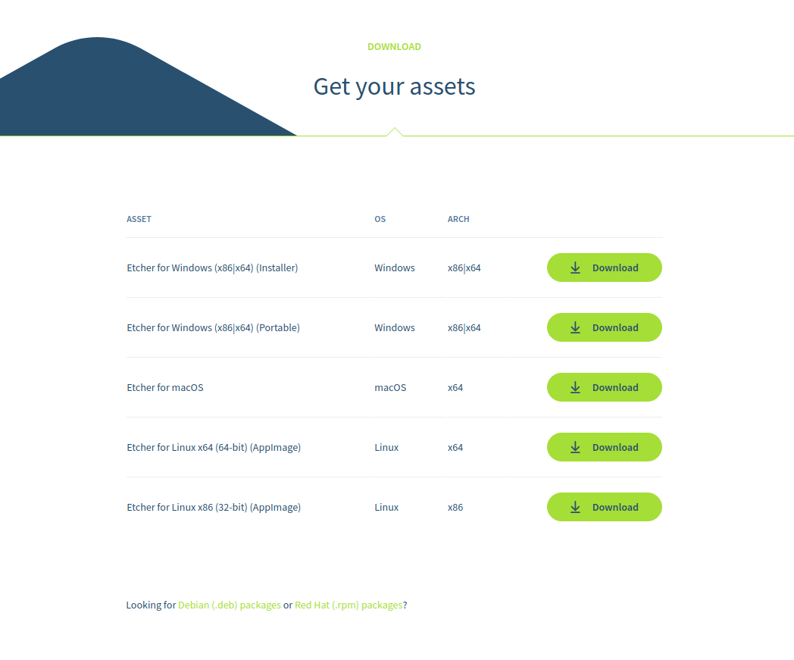
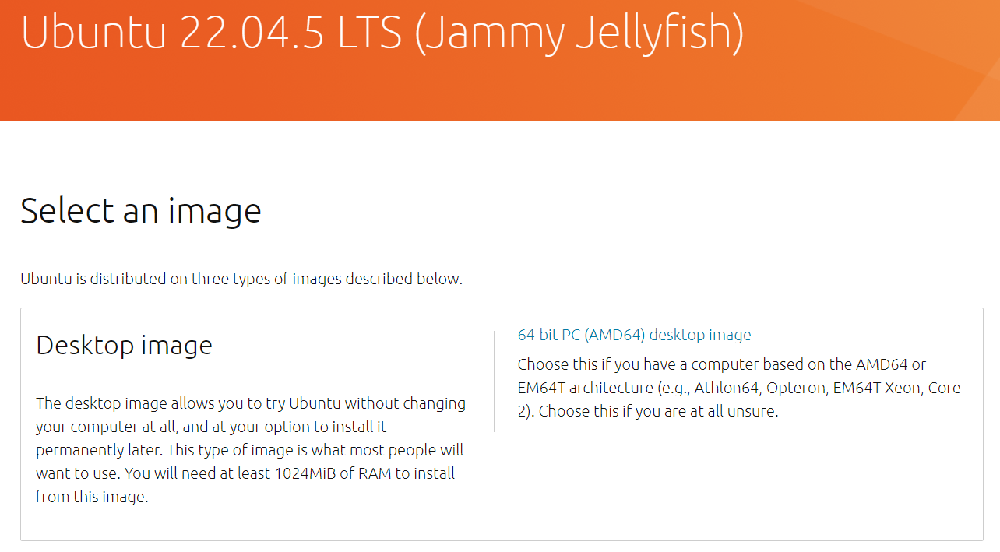
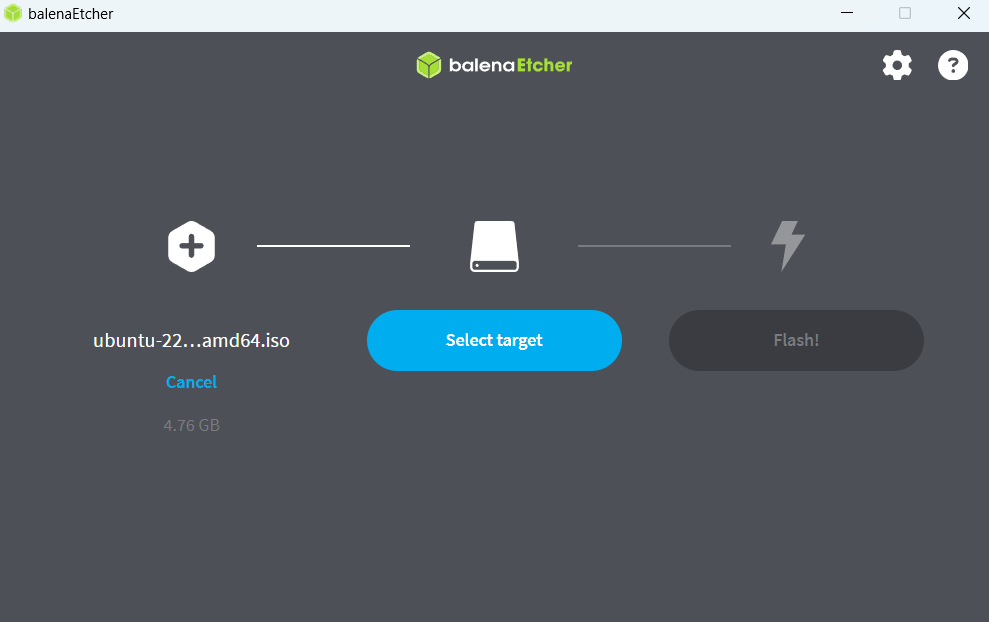

# 3. Create a Bootable USB Stick

To install Ubuntu Desktop, you need to write your downloaded ISO to a USB stick to create the installation media. This is not the same as copying the ISO, and requires some bespoke software.

For this tutorial, we’ll use [balenaEtcher](https://etcher.balena.io/), as it runs on Linux, Windows and Mac OS. Choose the version that corresponds to your current operating system, download and install the tool.

*-Etcher for Windows (x86|64)(Installer)*

After that, we'll use ISO image for ubuntu, select an image [Ubuntu 22.04.5 LTS(Jammy Jellyfissh)](https://mirror.twds.com.tw/ubuntu-releases/jammy/).

*-64-bit PC (AMD64) desktop image*

Select your downloaded ISO, choose your USB flash drive, and then click Flash! to install your image.

