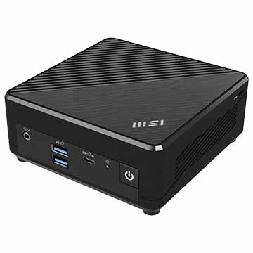
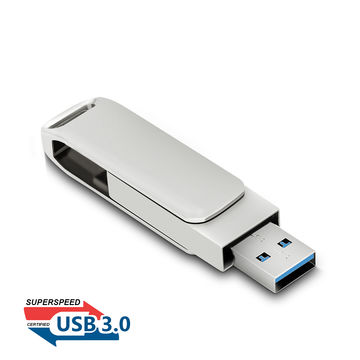

# 1. Overview

Linux is an open-source operating system (OS) widely used for servers, desktops, and embedded devices. It’s popular among developers and system administrators due to its open-source nature and high customizability. Linux comes in various distributions, such as Ubuntu, Fedora, Debian, and CentOS, each tailored for different use cases and user preferences. Linux's core strength lies in its terminal (command line interface), where users can execute commands to interact with the system directly.

In this tutorial, we will guide you through the steps required to install Ubuntu Desktop on your laptop or PC. To operate this system you could prepare:

- A laptop or PC with at least 25GB of storage space.

- A flash drive (12GB or above recommended).

