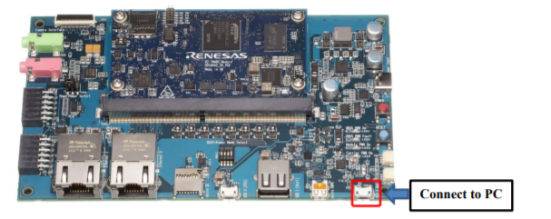
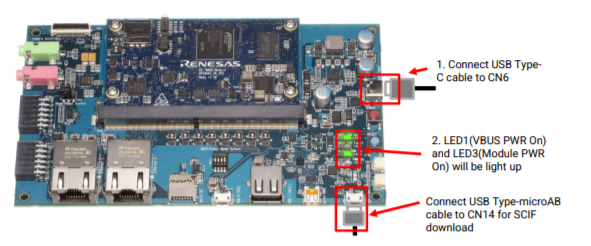
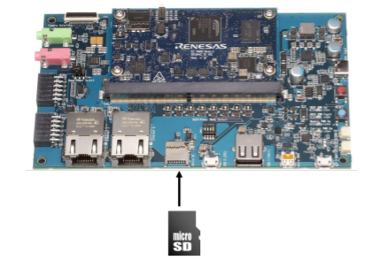
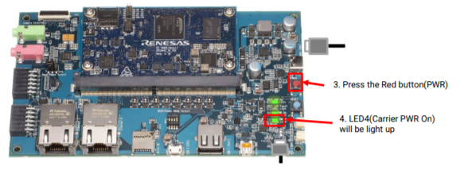
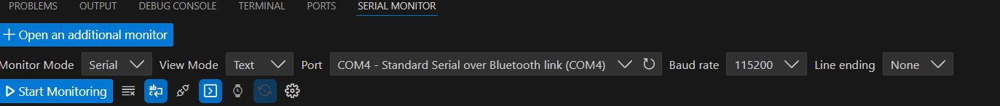
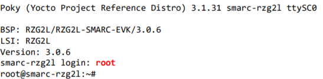

# 15. Booting and Running Linux

1) Please connect USB Type-micro-B cable to CN14

2) Connect USB-PD Power Charger to USB Type-C Connector (CN6). LED1(VBUS Power ON) and LED3 (Module PWR On) lights up.

3) Insert microSD card to slot on carry board.

4) Press the power button(SW9) to turn on the power. **Note: When turn on the power, press and hold the power button for 1 second. When turn off the power, press and hold the power button for 2 seconds**. LED4(Carrier PWR On) lights up

5) Bring up the terminal software and select the “File” > “New Connection” to set the connection on the software. Select the “Setup” > “Serial port” to set the settings about serial communication protocol on the software.

Set the settings about serial communication protocol on a terminal software as below:
- • Speed: 115200 bps
- • Data: 8bit
- • Parity: None
- • Stop bit: 1bit
- • Flow control: None

Press the Blue button (RESET) to boot the program. 

Press **Root** to login the "smarc-rzg21" and you can start to run the program. 

Congratuations!! You can start your Yocto Project now.