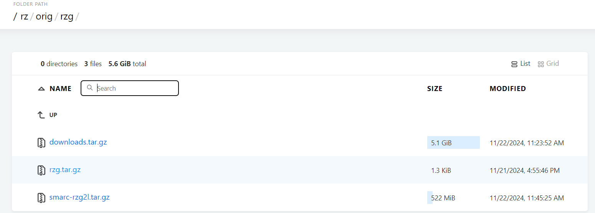

# 2. Build the New Devcontainer

You need to create a new forlder inside the devcontainer. You can go to "file" then add a new file. In this tutorial, we create a file name "work1". Please download this [rzg.tar.gz](http://192.168.113.104/rz/orig/rzg/).



After finish download, move the file into the "work1" folder.


Open the terminal and please extract the **rzg.tar.gz** file.

```
tar xzvf rzg.tar.gz
```


At the end, you need to build and create the new devcontainer.

