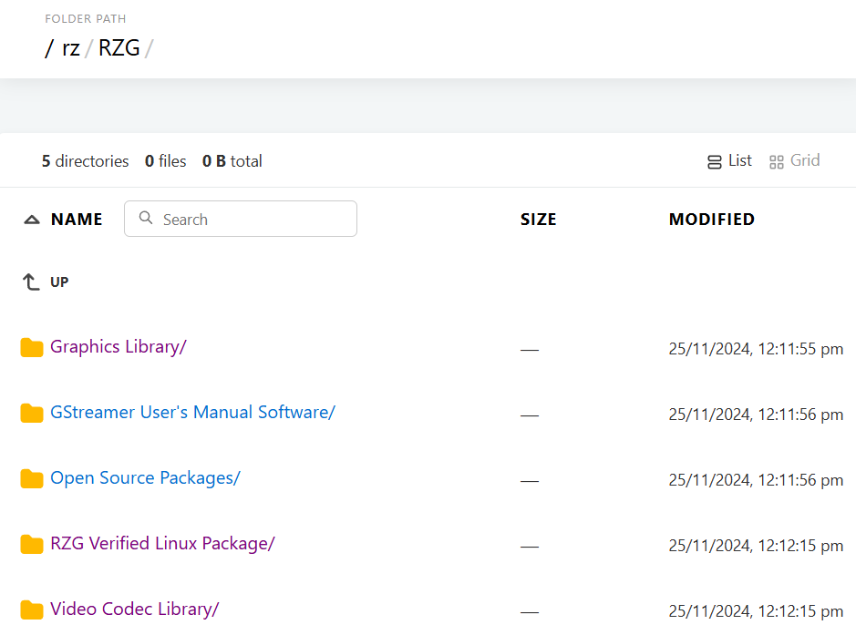

# 3. Download Renesas VLP Package

The VLP/G is only built in Ubuntu 20.04
Ubuntu 20.04 is required to build the VLP/G. This is because it was the only host operating system tested and is a
specific requirement for Yocto 3.1 (dunfell). Using Ubuntu 22.04 is not supported.
However, you can build the VLP inside a Docker container running Ubuntu 20.04. For this tutorial, we need download the [RZG Verified Linux Package](http://192.168.113.104/rz/RZG/RZG%20Verified%20Linux%20Package/), [Graphics Library](http://192.168.113.104/rz/RZG/Graphics%20Library/) and [Video Codec Library](http://192.168.113.104/rz/RZG/Video%20Codec%20Library/).

After download the file, you need to move these files to the RZG devcontainer as shown below.

