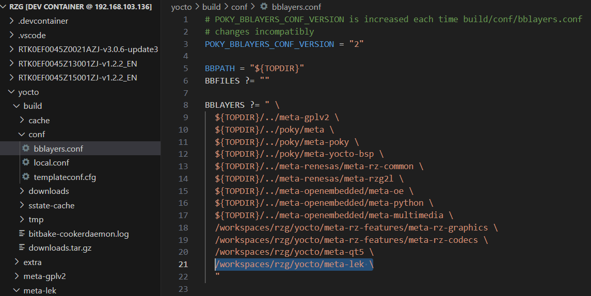
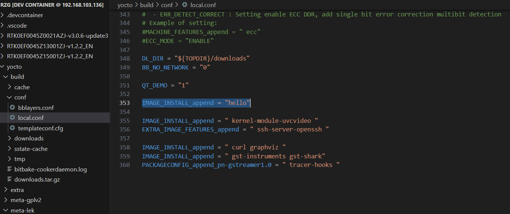

# 4. Add the Configuration

We need to modify the configurations in Yocto working folder, in order us to run the "hello world" program on Renesas RZ/G2L.

In the file `build/conf/bblayers.conf`, please add this command to define the configuration:

```
/workspaces/rzg/yocto/meta-lek \
```



In the file `build/conf/local.conf`, please add this command to define the configuration:

```
IMAGE_INSTALL_append = "hello"
```




