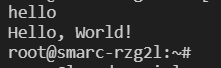

# 5. Run Docker Image "Hello, World!"

Please insert the MicroSD Card and you need to initialize the build enviroment again in docker.

```
source poky/oe-init-build-env build
```

After that, run the commands below to start a build of Core-Image-Qt.

```
sudo bmaptool copy core-image-qt-smarc-rzg2l.wic.gz /dev/sda
```

At the end, remove SD card and insert it to RZ/G2L and press the RESET button to boot up. Same as the previous tutorial, press **root** to run the program. You can run the commands to get the docker image of "**Hello, World!**" and run the image

