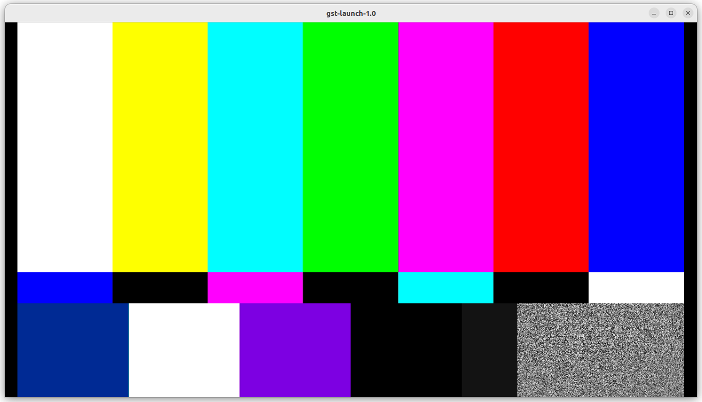
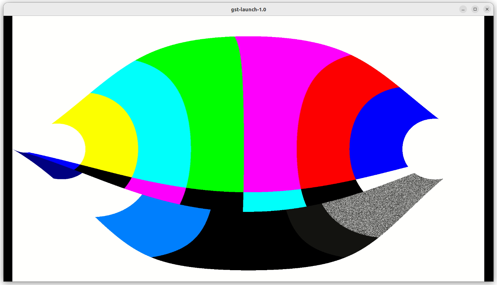
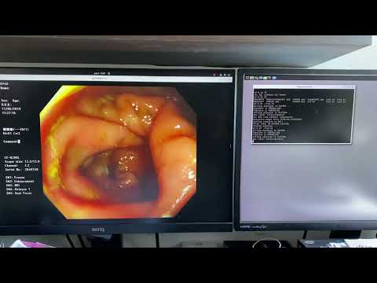
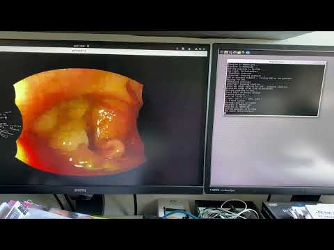
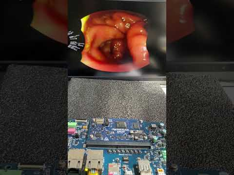

# 6. GStreamer Streaming Tests

Perform streaming tests first on PC/Ubuntu 22.04, then on RZ/G2L with hardware-specific encoder/decoder adjustments.

## 6.1 Basic Test:

First, we can take a look at the original video test source,

```
gst-launch-1.0 videotestsrc ! autovideosink
```



We then perform a simple test to make sure equirectangular filter work properly. Before that, please make sure the X,Y Maps are exist in the folder.

```
gst-launch-1.0 videotestsrc ! video/x-raw,width=1920,height=1080 ! videoconvert ! equirectangular ! videoconvert ! autovideosink
```

The output screen is as below,



## 6.2 Streaming Test:

We prepare to do a streaming test from RZ/G2L to PC,

First, open a terminal on Ubuntu 22.04, wait for receiving h.264 stream from RZ/G2L.

```
gst-launch-1.0 udpsrc port=5000 ! application/x-rtp,media=video,clock-rate=90000,encoding-name=H264,payload=96 ! rtph264depay ! avdec_h264 ! autovideosink
```

Below various test scripts are outlined for video streaming with increasing complexity, including decompression, processing, and compression steps. You can use scripts and data under /test_env folder for test

1. mp4 video file > streaming

Please change the **IP address** and **file name** in the .sh script in the following,

```
gst-launch-1.0 -e filesrc location=./endo01.mp4 ! qtdemux ! queue ! \
h264parse ! video/x-h264, stream-format=avc,alignment=au ! rtph264pay pt=96 name=pay0 \
config-interval=3 mtu=6000 ! udpsink host=192.168.103.136 port=5000
```

The result is as below,



2. mp4 video decompression > compression > streaming

Two important Gstreamer elements used on Renesas RZ/G2L h.264 decoder: omxh264dec h.264 encoder: omxh264enc

Please change the IP address and file name in the .sh script in the following,

```
gst-launch-1.0 -e filesrc location=./endo01.mp4 ! qtdemux ! queue ! \
h264parse ! omxh264dec ! omxh264enc ! rtph264pay config-interval=10 ! udpsink host=192.168.103.136 port=5000
```

3. mp4 video decompression > image processing ( equirectangular ) > compression > streaming

Please change the IP address and file name in the .sh script in the following,

```
h264parse ! omxh264dec ! videoconvert ! equirectangular ! videoconvert ! omxh264enc ! 
rtph264pay config-interval=10 ! udpsink host=192.168.0.105 port=5000h264parse ! 
omxh264dec ! videoconvert ! equirectangular ! videoconvert ! omxh264enc ! rtph264pay 
config-interval=10 ! udpsink host=192.168.0.105 port=5000
```



TIP
Since the execution speed is slower, some frames could be droped during the playback.
A longer mp4 test file would lead to better result.

4. mp4 video decompression > image processing ( equirectangular) > display

This test is simpler than the previous one. We can use it to compare the speed.

Please change the IP address and file name in the .sh script in the following,

```
gst-launch-1.0 -e filesrc location=./endo01.mp4 ! qtdemux ! queue ! \
h264parse ! omxh264dec ! videoconvert ! equirectangular ! videoconvert !
 autovideosink
```

Result output:



