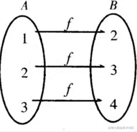

# 1. Overview

GStreamer is an extremely powerful and versatile framework for creating streaming media applications. However, writing new plugins is not always easy.

We already have a MOIL Equirectangular Gstreamer element, we hope to use it to link to more applications.

This chapter introduces the MOIL fisheye image processing technology implemented on the Renesas RZ/G2L hardware platform.

Due to the limited development and runtime performance of embedded systems, we initially develop and test on a PC and later deploy to the target hardware through cross-platform compilation.

Our goal is to implement MOIL image processing technology on the Renesas RZ/G2L, enabling image streaming over a network and fostering further system development on PC or other hardware environments.

The architecture is as follows:

The development process is described step by step:

1. Generating the Remap Mapping Files

2. Setting up the development environment using the `gst-plugins-bad-dev` project for GStreamer

3. Preparing the Renesas version of the `gst-plugins-bad` project and integrating the MOIL source code

4. Compiling the Yocto project on PC and writing the bootable image to an SD card

5. Booting Renesas RZ/G2L with the Yocto image and testing on the target board
