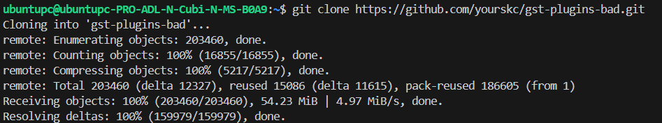
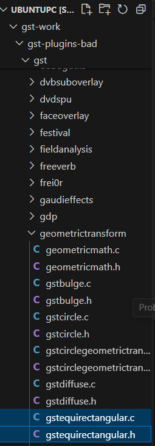
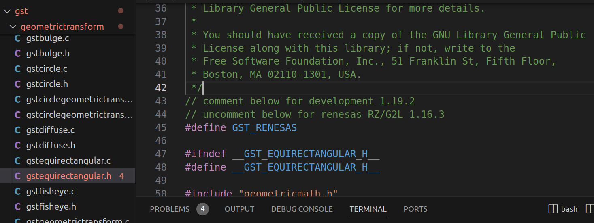
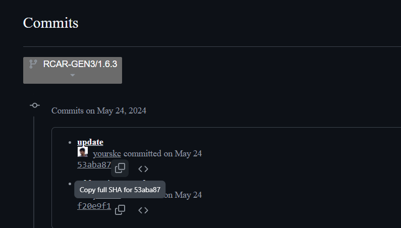

# 4. Preparing `gst-plugins-bad` Project for Yocto Compilation

If you intent to modify as your own copy, fork the repository and remember to set the commit ID corresponding to your copy before the Yocto build.
Clone the project,

```
git clone https://github.com/yourskc/gst-plugins-bad.git
```



The above cloned repository is ready to used for the Yocto build in the next section. You can skip the remaining description and jump to the next section.

If you want to modify the source code mentioned in the previous 2-3 section - "gst-plugins-bad-dev" project, you need to do the remaining steps.

Perform the steps,

1) Copy `gstequirectangular.c` and `gstequirectangular.h` under gst/geometrictransform/ in the development project 'gst-plugins-bad-dev' into the corresponding directory in 'gst-plugins-bad' project.



2) Uncomment the #define GST_RENESAS definition line in the source program.



3) Commit, push and remember the commit ID

```
git commit -m "comment"
git push
```

or you can get the commit ID on the below Github page,

[https://github.com/yourskc/gst-plugins-bad/tree/RCAR-GEN3/1.6.3](https://github.com/yourskc/gst-plugins-bad/tree/RCAR-GEN3/1.6.3)



Since the project in section 2-3 is build with Meson build. However, this project is build with GNU Automake

The build commands are as below,

```
./autogen.sh
make
```

This project is depend on some other packages. If you would like to try to build the project, we would suggest you try the compile process in Ubuntu 20.04.

However, since we already verify the corressness of the programs in the previous 2-3 section. We also can skip
the build process in this stage.
