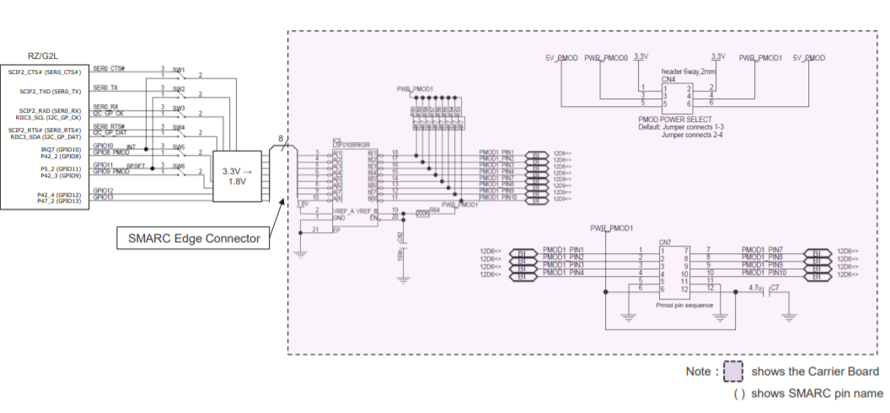
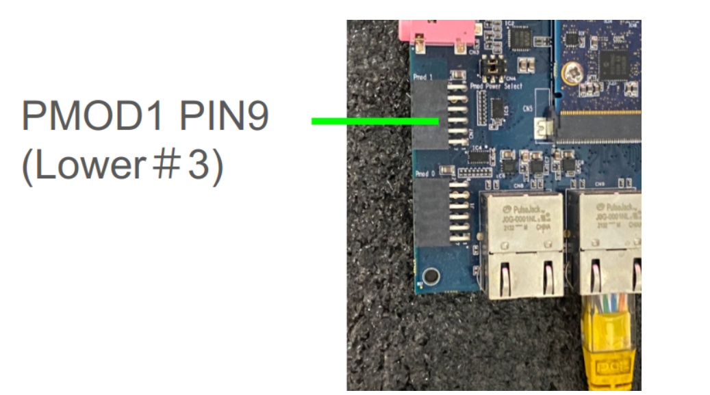
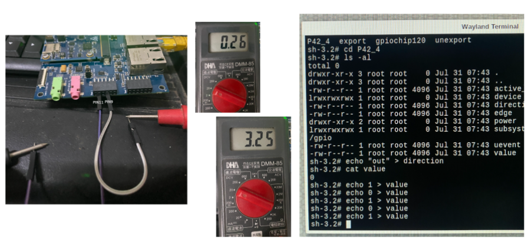

# 4. Control GPIO Hardware from C/ C++ Program

Access GPIO pins through the file system using the sysfs interface.

[https://www.ics.com/blog/how-control-gpio-hardware-c-or-c](https://www.ics.com/blog/how-control-gpio-hardware-c-or-c)

Example code :

```
int fd = open("/sys/class/gpio/export", O_WRONLY);
   if (write(fd, "460", 2) != 2) {
       perror("Error writing to /sys/class/gpio/export");
       exit(1);
    }
 close(fd);
```

Find out where is the hardware pin for P42_4?

[RZ SMARC Series Carrier Board User’s Manual: Hardware](http://140.112.12.82/docu-moil-renesas/assets/files/r01uh0966ej0122-rz-RTK97X4XXXB00000BE-9bfd716ef96e14f68272c6a65f662578.pdf)

Check Page 34, Figure 2.16 Block Diagram of PMOD1 I/F





We can test GPIO P42_4 at PMOD1 #9 Pin with a multimeter.

:::[Caution] Be careful not to burn your board! :::



