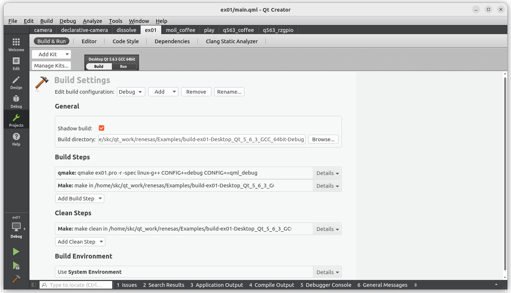
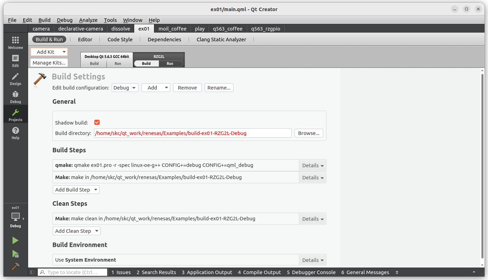
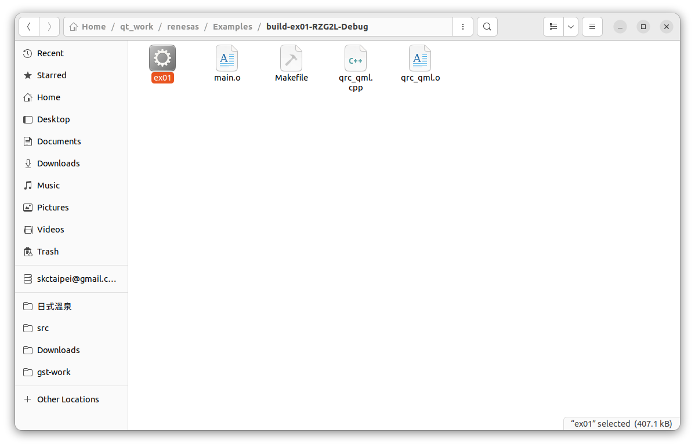
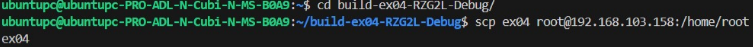
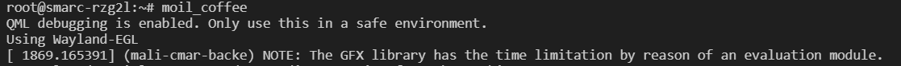

# 5. Build Executables for RZ/G2L

After period of time of development and check on our PC, suppose now we would like to build a version running on Renesas RZ/G2L target board. First in the Qt Creator, Click on `Projects` on the left side,

Click on `Add Kits`, RZ/G2L on the upper-left

Click on build button on the lower-left corner or click "Crrl+B", the generated executables would be in the folder,

`build-ex01-RZG2L-Debug/ex01`

Please send to RX/G2L for execution with the scp command. Below is the example, please change your username and IP address.

Next, we can start to run in the Renesas RZ/G2L. Please connect your renesas and start to monitor your project.

