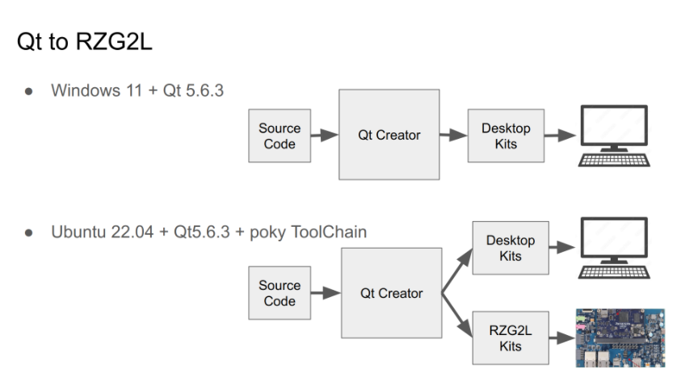

# 1. Overview

During the development time, we will take much time on the modification of programs and then rebuild them again. For the efficiency consideration, we would build our application on PC instead of target platform.

The architecture is as below

In the chapters, We will show you how to setup the Qt development environment both on Ubuntu 22.04 and Windows 11.

For Windows 11, it would be simpler, we just use it for UI development, please download and install Qt5.6.3. That's already enough for development purpose.

However, for Ubuntu 22.04, we'll install additional kits tools for building for our target board Renesas RZ/G2L. That can be used to make the final software for our product.