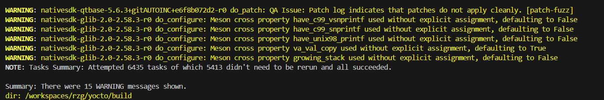
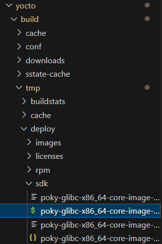
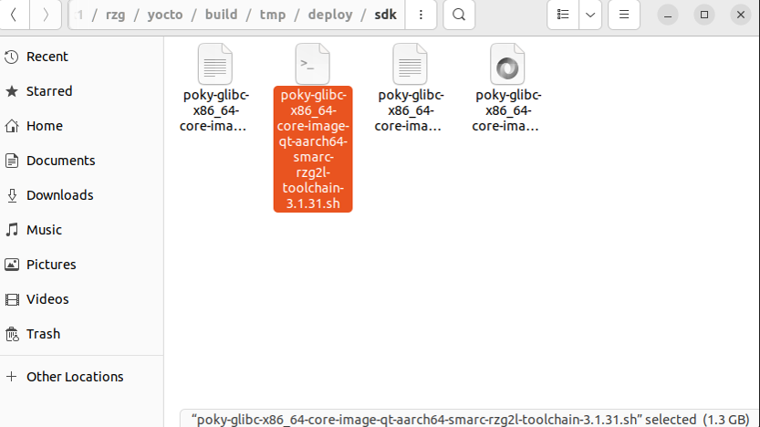
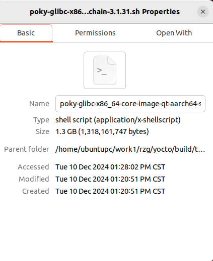
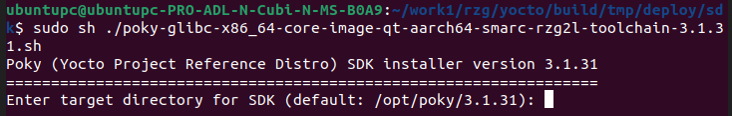

# 2. Prepare the Toolchain

We need to compile the Yocto project to make the toolchain, the toolchain will be installed on system, We'll use them when we set the compilers, linkers and debugger in the settings of Qt Creator later.

Within the docker container Ubutu 20.04, please build the yocto project with appended parameters `-c polulate_sdk`

```
MACHINE=smarc-rzg2l bitbake core-image-qt -c populate_sdk
```


After the build of Yocto project, the output script can be used to installed on your system, which would be located at

```
<work_dir>/build/tmp/deploy/sdk/poky-glibc-x86_64-core-image-qt-aarch64-smarc-rzg2l-toolchain-3.1.31.sh
```



Please also check and open this file in the Ubuntu Environment.



Right click on the file, then click on the checkbox `Permission/ Allow executing file as program`



Now you can run the script to install the toolchain on your Ubuntu 22.04.

```
sudo sh ./poky-glibc-x86_64-core-image-qt-aarch64-smarc-rzg2l-toolchain-3.1.31.sh
```
The default installed location would be `/opt/poky/3.1.31`. All the tools under this floder will be used in the kits settings of Qt Creator.

