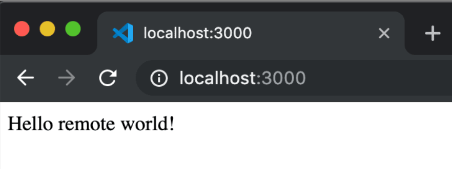

# 4. Check Your Environment

One of the useful things about developing in a container is that you can use specific versions of dependencies that your application needs without impacting your local development environment.

The specific container for this tutorial has Node.js v18 installed, which you can check by opening a new terminal Terminal > New Terminal (Ctrl+Shift+`) and entering:

```
node --version; npm --version
```

This should show the following versions:


Now, you can hit F5, which will run the application inside the container. Once the process starts, navigate to http://localhost:3000 and you should see the simple Node.js server running!

