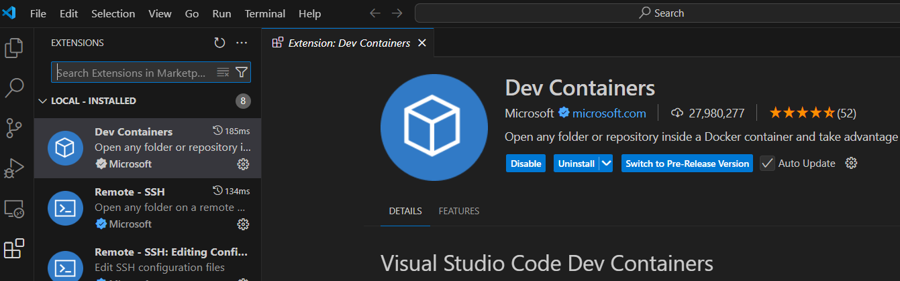
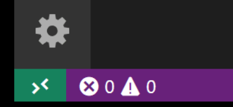

# 2. Install Docker Containers

In this tutorial, we will learn how to run Visual Studio Code in a Docker container using the Dev Containers extension. Running VS Code inside a Docker container can be useful for many reasons, but in this walkthrough we'll focus on using a Docker container to set up a development environment that is separate from your local environment.

Before proceeding, ensure you have the following installed on your system:

- [Visual Studio Code (VS Code)](https://code.visualstudio.com/)

- Remote - Containers Extension

Install the Remote - Containers extension in VS Code from the Extensions Marketplace.

Please check the installation, it will show a new Status bar item at the far left.

