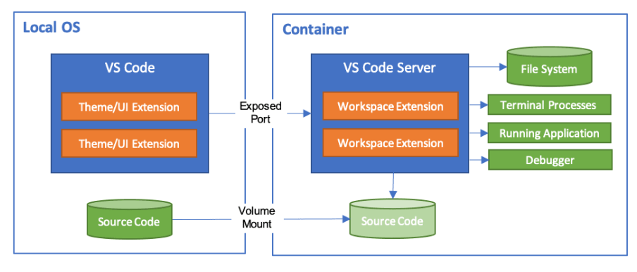

# 1. Overview

The **Visual Studio Code Dev Containers** extension lets you use a container as a full-featured development environment. It allows you to open any folder inside (or mounted into) a container and take advantage of Visual Studio Code's full feature set. A devcontainer.json file in your project tells VS Code how to access (or create) a development container with a well-defined tool and runtime stack. This container can be used to run an application or to separate tools, libraries, or runtimes needed for working with a codebase.

Workspace files are mounted from the local file system or copied or cloned into the container. Extensions are installed and run inside the container, where they have full access to the tools, platform, and file system. This means that you can seamlessly switch your entire development environment just by connecting to a different container.

This lets VS Code provide a local-quality development experience including full IntelliSense (completions), code navigation, and debugging regardless of where your tools (or code) are located.