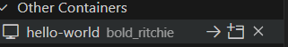

# 4. Verify the Installation

Now, please try to verify that the installation is successful by running the `hello-world` image:

```
sudo docker run hello-world
```

This command downloads a test image and runs it in a container. When the container runs, it prints a confirmation message and exits.



You have now successfully installed and started Docker Engine. Hello