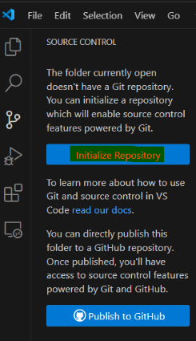

# 4. Initialize the Repository

Open your project folder in VS Code and initialize Git:

```
git init
```

Alternatively, you can also select "Source Control" at the side panel and click "Initialize Repository".



