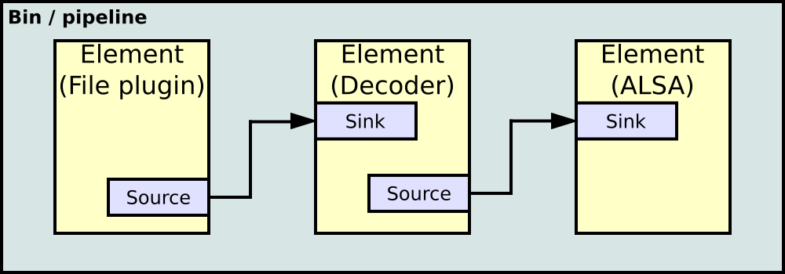
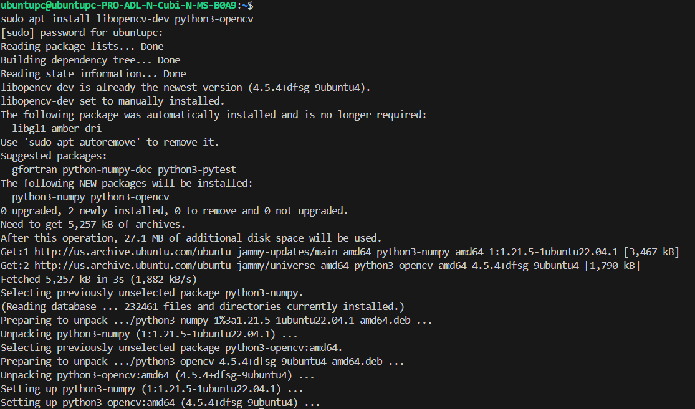
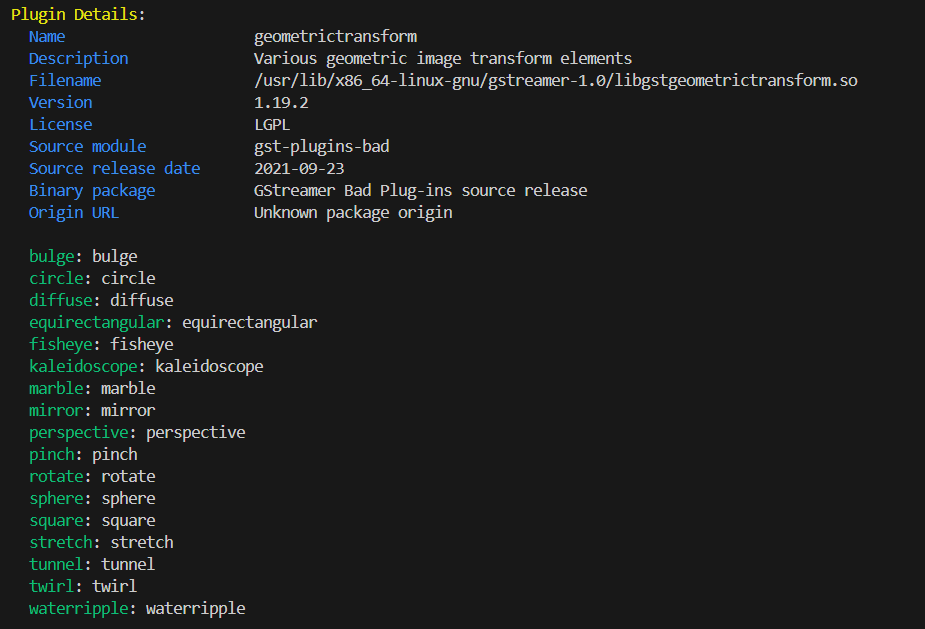
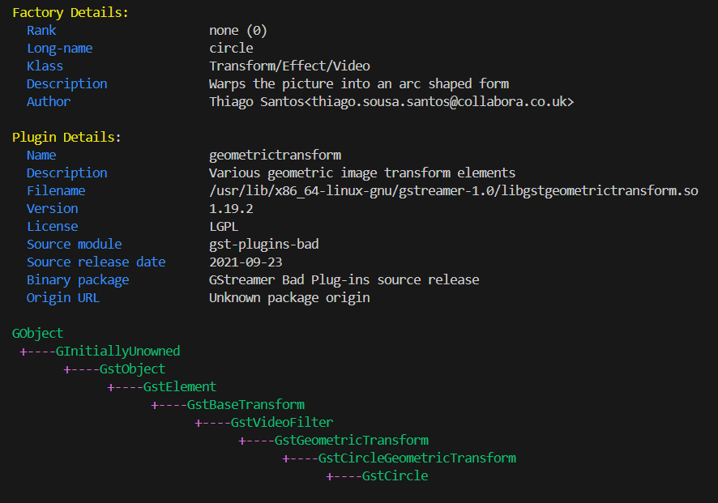
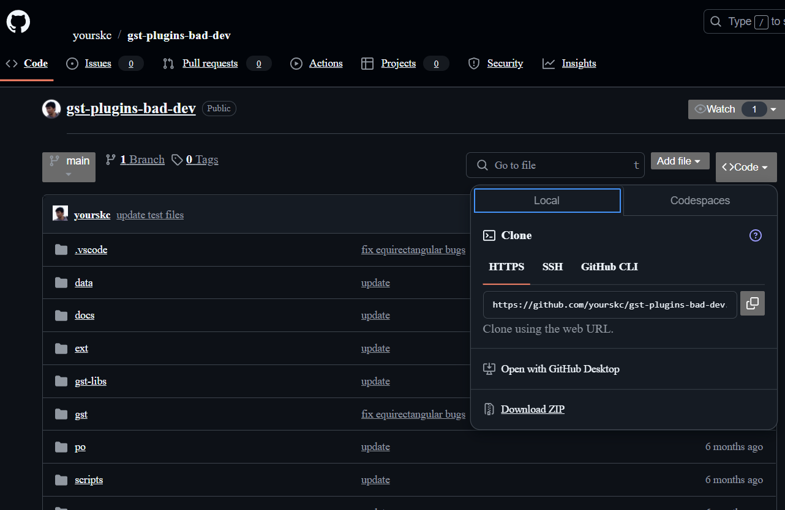
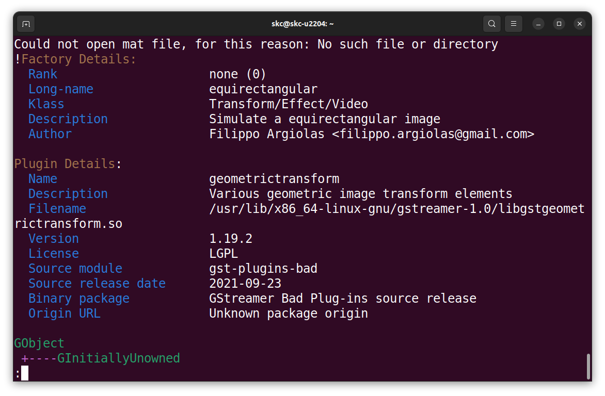
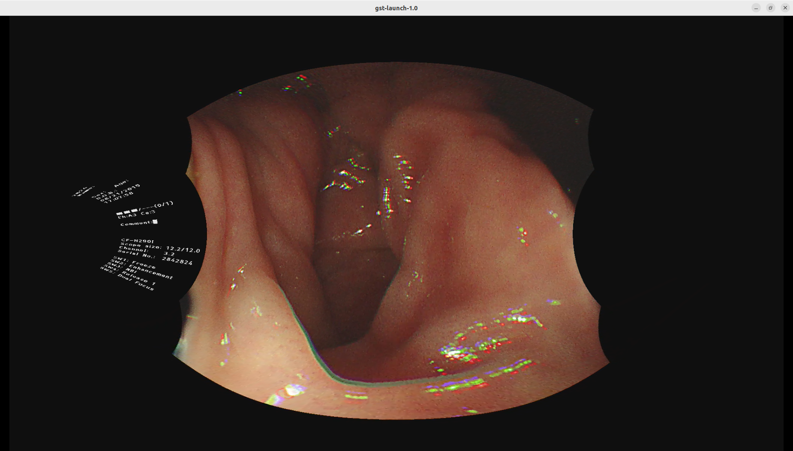
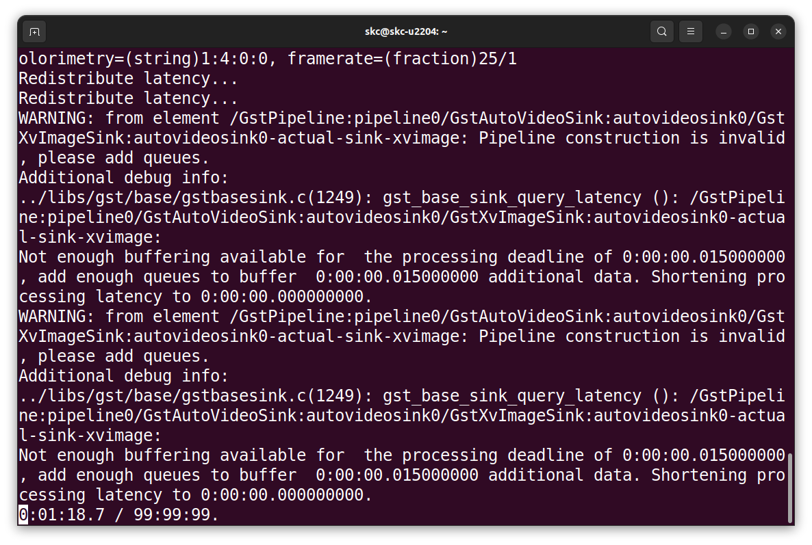
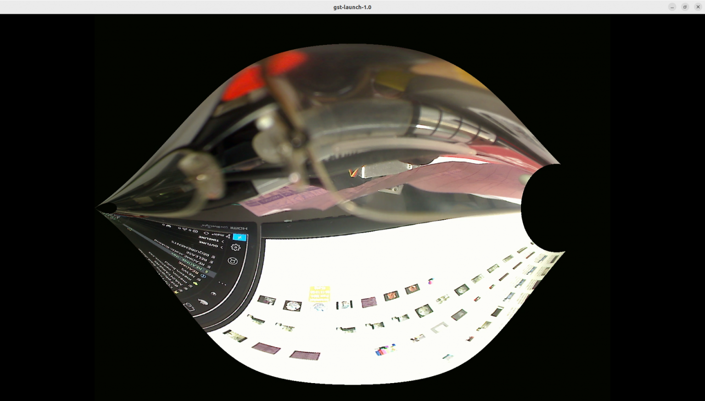

# 3. Developing the `gst-plugins-bad-dev` Project on PC

GStreamer is a **pipeline-based multimedia framework** that links together a wide variety of media processing systems to complete complex workflows. For instance, GStreamer can be used to build a system that reads files in one format, processes them, and exports them in another. The formats and processes can be changed in a plug and play fashion.

GStreamer is an extremely powerful and versatile framework for creating streaming media applications. However, writing new plugins is not always easy.

The below is how GStreamer elements linked as a pipeline.



## 3.1 Install OpenCV

We will build the gst-plugins-bad-dev project, please install OpenCV first, the installation command is as below,

```
sudo apt install libopencv-dev python3-opencv
```




## 3.2 Install libmoildev.so

Please follow the instructions on the Github repository, install it on our x86_64 platform.

[https://github.com/yourskc/moildev_install](https://github.com/yourskc/moildev_install)

## 3.3 Install GStreamer

[https://gstreamer.freedesktop.org/documentation/installing/index.html?gi-language=c](https://gstreamer.freedesktop.org/documentation/installing/index.html?gi-language=c)

To completely install GStreamer on Ubuntu 22.04, use the commands below,

```
sudo apt install libgstreamer1.0-dev libgstreamer-plugins-base1.0-dev libgstreamer-plugins-bad1.0-dev gstreamer1.0-plugins-base gstreamer1.0-plugins-good gstreamer1.0-plugins-bad gstreamer1.0-plugins-ugly gstreamer1.0-libav gstreamer1.0-tools gstreamer1.0-x gstreamer1.0-alsa gstreamer1.0-gl gstreamer1.0-gtk3 gstreamer1.0-qt5 gstreamer1.0-pulseaudio
```

## 3.4 Basic Tutorials : Hello World!!

[https://gstreamer.freedesktop.org/documentation/tutorials/basic/hello-world.html?gi-language=c](https://gstreamer.freedesktop.org/documentation/tutorials/basic/hello-world.html?gi-language=c)

Compile the above with the command below,

```
gcc basic-tutorial-1.c -o basic-tutorial-1 `pkg-config --cflags --libs gstreamer-1.0`
```

## 3.5 Command Line Tools

We will use the command line tools gst-inspect-1.0 and gst-launch-1.0 most of the time for our test.

1. This is the Linux man page for the `gst-inspect-1.0` tool. 

gst-inspect-1.0
[https://gstreamer.freedesktop.org/documentation/tools/gst-inspect.html?gi-language=c#](https://gstreamer.freedesktop.org/documentation/tools/gst-inspect.html?gi-language=c#synopsis)

The below commands will show the information includes the source module, plugin and element,

Examples:

```
gst-inspect-1.0 opencv
```

```
gst-inspect-1.0 geometrictransform
```



```
gst-inspect-1.0 circle
```




2. This content comes mostly from the Linux man page for the `gst-launch-1.0` tool. 

gst-launch-1.0
[https://gstreamer.freedesktop.org/documentation/tools/gst-launch.html?gi-language=c#](https://gstreamer.freedesktop.org/documentation/tools/gst-launch.html?gi-language=c#)

The below commands will show the information includes the source module, plugin and element,

Let's Try,

`gst-launch-1.0 videotestsrc ! autovideosink` 

`gst-launch-1.0 videotestsrc pattern=0 ! autovideosink`

where pattern = 0 ..25

`gst-launch-1.0 videotestsrc ! video/x-raw, width=1920, height=1080 ! autovideosink` 

`gst-launch-1.0 videotestsrc ! video/x-raw, width=1920, height=1080 ! videoconvert ! circle ! videoconvert ! autovideosink` 


We already have a MOIL Equirectangular GStreamer element, we hope to use it to link to more applications in the future.

## 3.6 Project Download

The project mentioned in this section we'll used in the Yocto project building. However, this one is based on a newer Gstreamer version, and is fully compatible with our developing environment Ubuntu 22.04. We can add or modify programs then verify the functionality on our system.

Download our modified version project:

[https://github.com/yourskc/gst-plugins-bad-dev](https://github.com/yourskc/gst-plugins-bad-dev)

This project includes a new element named equirectangular as part of the gst-plugins-bad geometric transform plugin. It contains GStreamer code units, build instructions, and test commands. You can clone the project or download the zip file.



## 3.7 Install Meson

Install the Meson build system:

[https://mesonbuild.com/Quick-guide.html](https://mesonbuild.com/Quick-guide.html)

```
sudo apt-get install python3 python3-pip python3-setuptools \
python3-wheel ninja-build

pip3 install --user meson
```

Build

```
meson build
ninja -C build
```

Verify the creation of .so files in:

```
<work_dir>/build/gst/geometrictransform
```

Install the library locally for verification:

```
sudo cp ./build/gst/geometrictransform/libgstgeometrictransform.so /usr/lib/x86_64-linux-gnu/gstreamer-1.0
```

Then copy the .so file to your system folder,

```
sudo cp libgstgeometrictransform.so /usr/lib/x86_64-linux-gnu/gstreamer-1.0
```

Check with `gst-inspect-1.0`:

```
gst-inspect-1.0 geometrictransform
```
and

```
gst-inspect-1.0 equirectangular
```

Expected output:




## 3.8 Start Testing

Basic test with video test source:

```
cd test_env
gst-launch-1.0 videotestsrc ! video/x-raw,width=1920,height=1080 ! videoconvert ! equirectangular ! videoconvert ! autovideosink
```


To test with mp4 video files, use the example below:

```
gst-launch-1.0 playbin uri=file://home/skc/gst-work/gst-plugins-bad-dev/test_env/endo01.mp4 video-sink='videoconvert ! equirectangular ! videoconvert ! autovideosink'
```

There some .jpg image files and .mp4 video files under /test_env folder. Change the data folder location in the below command according to your actual situation.

```
gst-launch-1.0 playbin uri=file:///home/skc/gst-work/gst-plugins-bad-dev/test_env/endo01.mp4 video-sink='videoconvert ! equirectangular ! videoconvert ! autovideosink'
```



Another test is as below,

```
gst-launch-1.0 filesrc location=endo01.mp4 ! qtdemux ! queue ! avdec_h264 ! videoconvert ! equirectangular ! videoconvert ! autovideosink
```

Next, we would test network streaming. Open a Terminal window as udp receiver first

```
gst-launch-1.0 -v udpsrc uri=udp://127.0.0.1:5000 ! application/x-rtp, media=video, payload=96, encoding-name=H264 ! rtph264depay ! avdec_h264 ! videoconvert ! autovideosink
```

The below is the waiting for the incoming stream



First, we use a very simple video test source,

```
gst-launch-1.0 videotestsrc ! video/x-raw, width=1920, height=1080 ! videoconvert ! equirectangular ! videoconvert ! x264enc ! rtph264pay config-interval=10 ! udpsink host=127.0.0.1 port=5000
```

Then we test a still image source,

```
gst-launch-1.0 filesrc location=image1920.jpg ! decodebin ! imagefreeze ! videoscale ! video/x-raw,width=1920,height=1080 ! videoconvert ! equirectangular ! videoconvert ! x264enc ! rtph264pay config-interval=10 ! udpsink host=localhost port=5000
```

## 3.9 USB Camera

We connect our PC with an USB camera, and replace the video source with "v4l2src device=/dev/video0" in the command.

Before you run the video, please make sure you have install and you can get the information of the device. 

Installation :

```
sudo apt-get install v4l-utils
```

List all camera devices

```
v4l2-ctl --list-devices
```

Display driver information

```
v4l2-ctl -d /dev/video0 -D
```

Get camera supported image format

```
v4l2-ctl -d /dev/video0 --list-formats

v4l2-ctl -d /dev/video0 --list-formats-ext
```

If you cannect with a normal USB camera, the result screen will be like the below,

```
gst-launch-1.0 v4l2src device=/dev/video0 ! videoscale ! video/x-raw, width=1920, height=1080 ! videoconvert ! equirectangular ! videoconvert ! x264enc ! rtph264pay config-interval=10 ! udpsink host=127.0.0.1 port=5000
```



The flow of streaming mp4 file is,

Decompression > Transformation > Compression > Streamering

```
gst-launch-1.0 filesrc location=endo01.mp4 ! qtdemux ! queue ! avdec_h264 ! videoconvert ! equirectangular ! videoconvert ! x264enc ! rtph264pay config-interval=10 ! udpsink host=127.0.0.1 port=5000 -v
