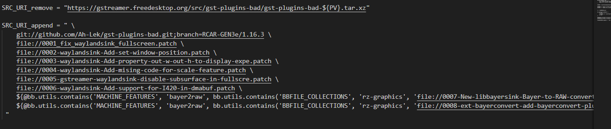
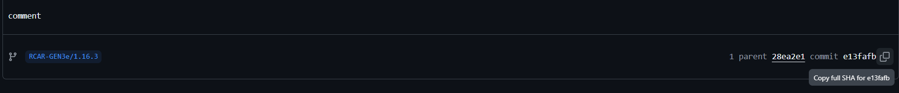

# 5. Editing Recipes and Recompiling Yocto Project 

Please ensure you already have a Docker container for Yocto project compilation.

1) Open the `.bbappend` file in the Yocto environment.

```
meta-renesas/meta-rz-common/recipes-multimedia/gstreamer/gstreamer1.0-plugins-bad_1.16.3.bbappend
```

2) Add the GitHub repository.

```
SRC_URI_append = " \
git://github.com/Ah-Lek/gst-plugins-bad.git;branch=RCAR-GEN3e/1.16.3 \
```



3) Insert the commit ID.

```
SRCREV="<commit ID>"
```


You can also find your commit ID from Github.




Compile the Yocto image and write it to an SD card, but don't forget to initialize and build image before you compile:

```
sudo bmaptool copy <image>.wic.gz /dev/sdX
```

Then we can perform testings on RZ/G2L. Boot the RZ/G2L board and verify if the library exist with:

```
gst-inspect-1.0 equirectangular
```

The output would be as below, it reveal the exist of equirectangular element in the Gstreamer library


Prepare working directories in RZ/G2L,

```
cd /home/root
mkdir gst-work
cd gst-work
```

Please transfer your test data from PC to RZ/G2L:

```
scp -r user@IP:/path/to/test_env/* .

For example, 

scp -r skc@192.168.0.105:/home/skc/gst-work/gst-plugins-bad-dev/test_env/* .
* .
```

Please note that, the user@IP is from the RZ/G2L. You can try to find with command below:

To check the User.
```
whoami
```

To check the IP address.
```
ifconfig
```