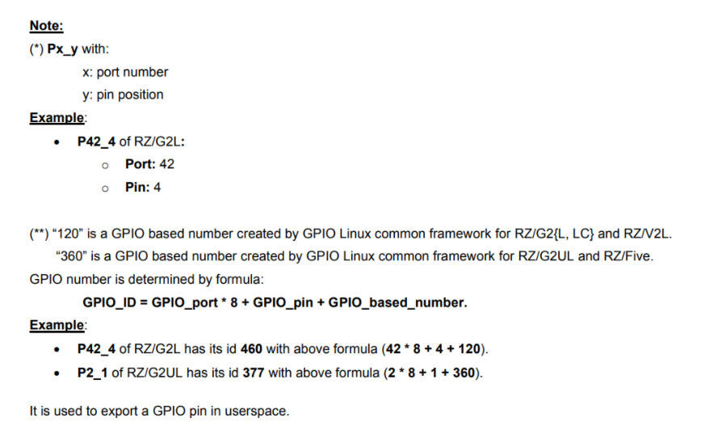
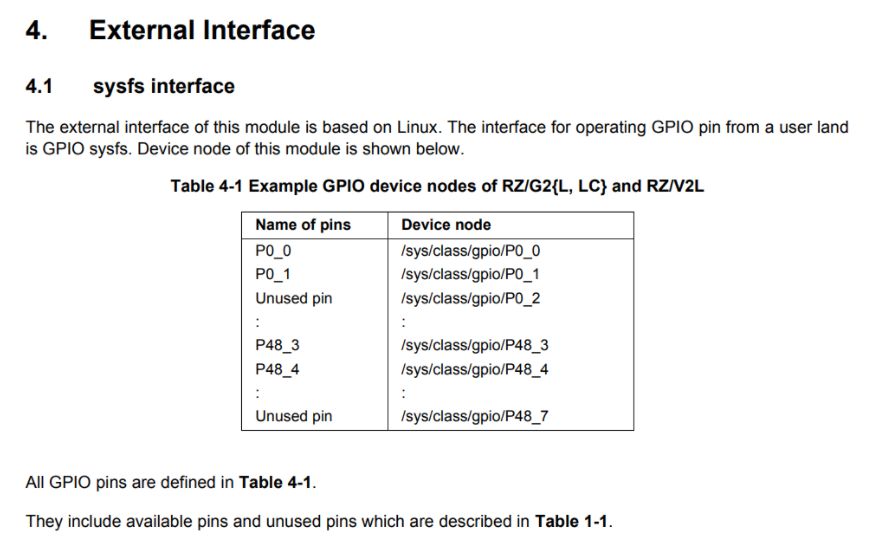

# 3. Renesas GPIO Definition

Reference to the below Renesas GPIO document we mentioned in Section 1.

[r01us0488ej0109-rz-g_GPIO_UME.pdf](http://140.112.12.82/docu-moil-renesas/assets/files/r01us0488ej0109-rz-g_GPIO_UME-d2505425b42fa90976cf6547fe538323.pdf)

RZ/G2L can support up to 123 general-purpose I/O pins from 49 ports ( Page 8. Table ). Page 14 show the formula in the above document:



For example: P42_4

ID of P42_4 = 42 * 8 + 4 + 120 = 460.

It is used to export a GPIO pin in userspace.

Table 4-1 Example GPIO device nodes of RZ/G2L ( Page 16. in the above document).



Test :

```
cd /sys/class/gpio
echo 460 > export
ls -al 
```

A new folder will be shown,

```
P42_4
```

Check the description about P42_4 in the above document,


Continue the below testing,

```
echo 1 > value ( error )
cat direction 
in
echo “out” > direction 
cat direction
out
echo 1 > value
cat value
echo 0 > value
cat value
```

Now we want to find out the pin corresponding. Check the document of the carrier board.

```
"Documentation"/ "Manual - Development Tools"/

"RZ SMARC Series Carrier Board User's Manual:Hardware"
```

In the below Renesas document,

[RZ/G2L-EVKIT - Evaluation Board Kit for RZ/G2L MPU](https://www.renesas.com/en/products/microcontrollers-microprocessors/rz-mpus/rzg2l-evkit-evaluation-board-kit-rzg2l-mpu#documents)