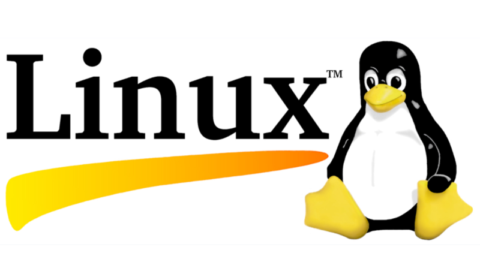

# 1. Overview

Linux is an open-source operating system widely used for servers, desktops, and embedded devices. It’s popular among developers and system administrators due to its open-source nature and high customizability. 

The Linux command line is a text interface to your computer. Often referred to as the shell, terminal, console, prompt or various other names, it can give the appearance of being complex and confusing to use. Yet the ability to copy and paste commands from a website, combined with the power and flexibility the command line offers, means that using it may be essential when trying to follow instructions online, including many on this very website! If you're a beginner, this guide will help you get started with some essential concepts and commands in Linux.🚀🚀

