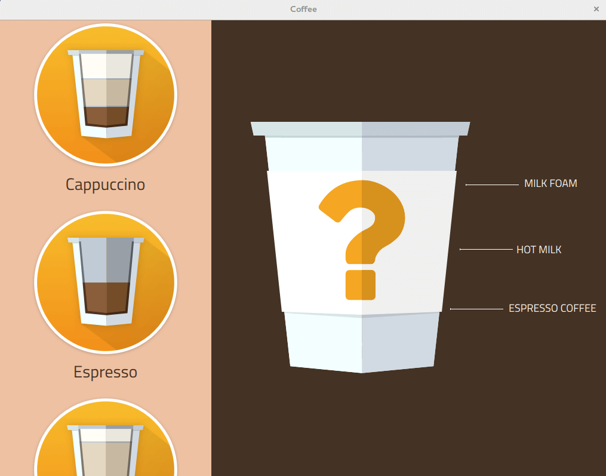

# 6. Coffee Machine Example

The official Qt Coffee Machine Example is here, but this is run in Qt 5.15 LTS Example:

[Qt Coffee Machine Example](https://doc.qt.io/qt-5/qtdoc-demos-coffee-example.html)



However, the above version can not be compilied successfully in the environment, please use the modified version below.

```
git clone https://github.com/yourskc/moil_coffee.git
```

This example project is based on the examples of Qt5.12.10 with some modification that make it can pass the compilation of Qt5.6.3, it has also been tested on Renesas RZ/G2L.

Please follow the steps previous to compile and run the Coffee Machine project in Ubuntu 22.04. Please reference the steps in previous section to compile this project with RZ/G2L kits settings then transfer and run it on RZ/G2L.

The operation of this project is not limit to mouse, you also can attach it with an touch screen, and control the UI just like a mobile device or smart device.

The output will be like this:


The demo video is as below,

[Demo Video](https://www.youtube.com/watch?v=it3XaNYqQ_c)

Another demo using touchscreen,

[Demo Video](https://www.youtube.com/watch?v=KOlx9MPbCOY)

The above is our Coffee Machine example. For the future development, we need to take time to pratice programming using QML/ Qt Quick. You also can reference to the use of the assets in this project, to make your own UI design.

Reference :

- [Qt Quick Control](https://doc.qt.io/qt-5/qtquickcontrols-index.html)

- [Qt Quick Designer](https://doc.qt.io/qtcreator/creator-qtquickdesigner-plugin.html)