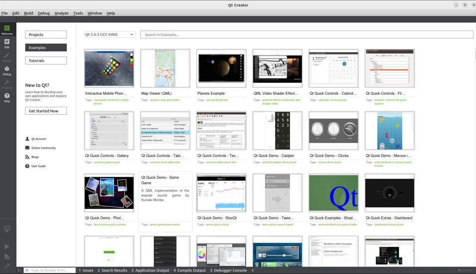
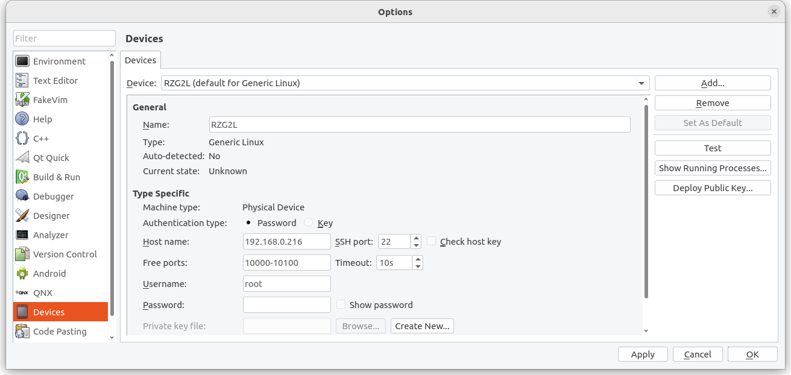
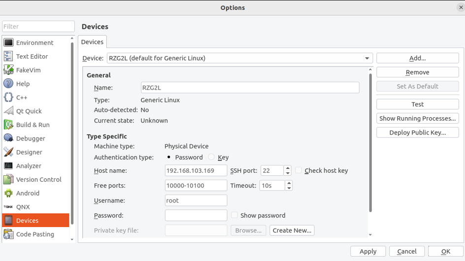
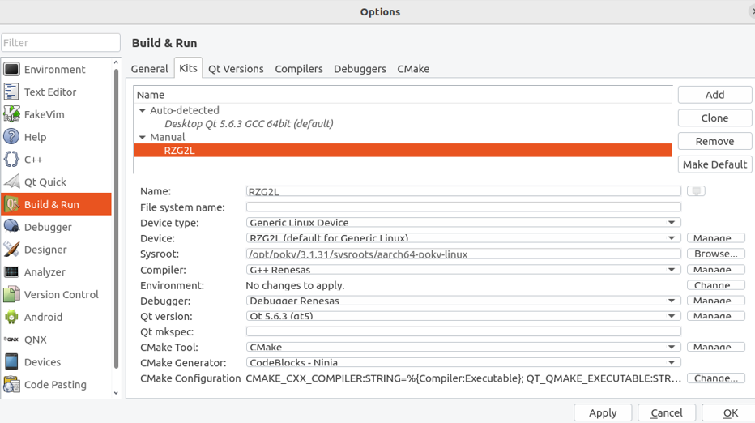
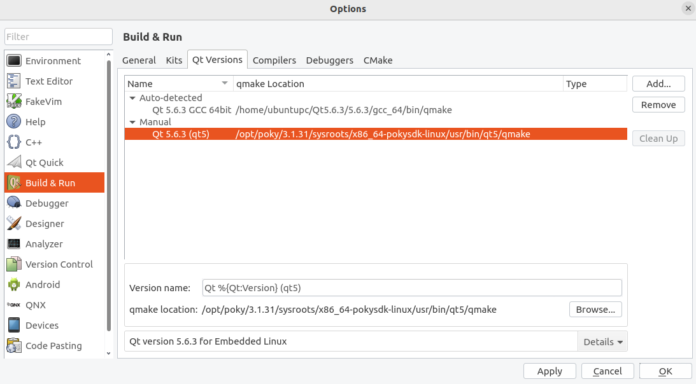
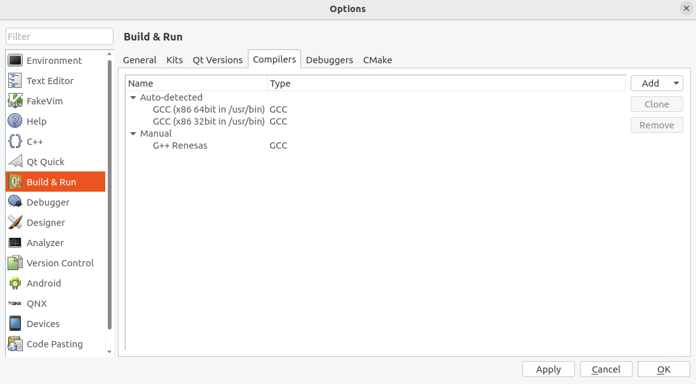
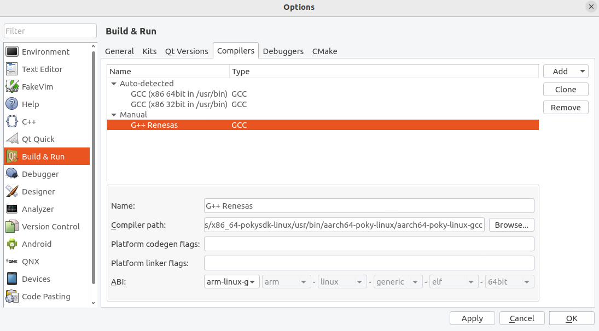
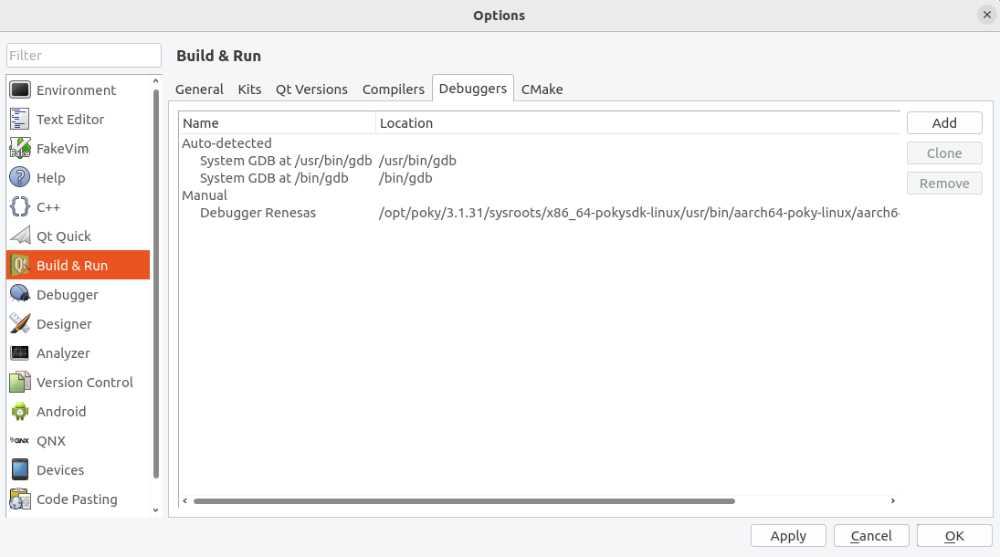
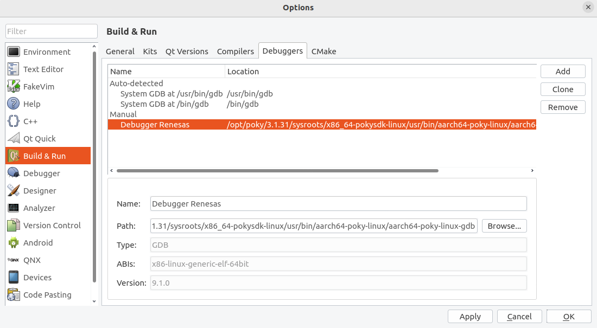
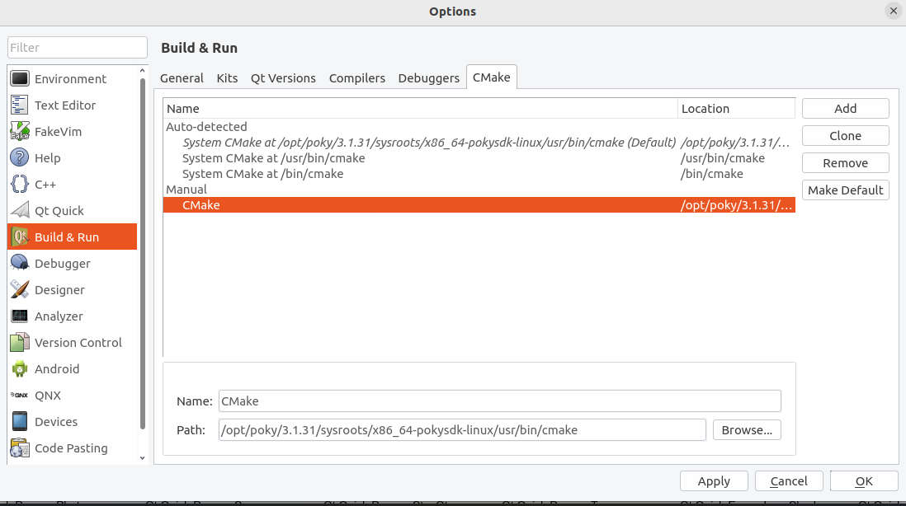

# 3. Qt Creator Installation

Please install Qt5.6.3 in Ubuntu 22.04, we'll use it as our mainly used version. Download and install Qt from the below,

[Qt5.6.3 Download](https://download.qt.io/new_archive/qt/5.6/5.6.3/)


Before running of Qt Creator, we need to set the environment variables. Open a terminal window, paste the commands,

```
unset LD_LIBRARY_PATH

source /opt/poky/3.1.31/environment-setup-aarch64-poky-linux
```

Run Qtcreator ( Qt5.6.3 )

```
cd ~/Qt5.6.3/Tools/QtCreator/bin/
./qtcreator
```



**Everytime running the Qt Creator, we need to set the environment variables first.**

Select the menu of Qt Creator `Tools/ External/ Configure`. On the left side, click on Devices, Input the IP of RZ/G2L, click `Test` to start connection test.



Click on Build & Run on the left, Choose Kits, Then Add, Set Name as "RZ/G2L", Set C/C++ Compiler, Debugger, Qt Version, alternatively you can click on the Manager on the right side, add and set the paths, or Choose from the Tabs on the upper items(Qt Version/ Compiler/ Debuggers ). Set all of the settings.



The below is a settings example:

- Device : Select the Device in the previous step,

- Sysroot : /opt/poky/3.1.31/sysroots/aarch64-poky-linux

- C Compiler : /opt/poky/3.1.31/sysroots/x86_64-pokysdk-linux/usr/bin/aarch64-poky-linux/aarch64-poky-linux-gcc

- C++ Compiler : /opt/poky/3.1.31/sysroots/x86_64-pokysdk-linux/usr/bin/aarch64-poky-linux/aarch64-poky-linux-g++

- Debugger : /opt/poky/3.1.31/sysroots/x86_64-pokysdk-linux/usr/bin/aarch64-poky-linux/aarch64-poky-linux-gdb

- Qt Version : /opt/poky/3.1.31/sysroots/x86_64-pokysdk-linux/usr/bin/qt5/qmake

- cmake : /opt/poky/3.1.31/sysroots/x86_64-pokysdk-linux/usr/bin/cmake

Screen captures for your reference,















After the settings, please make sure there are no exclamation on the Kits icon, or you need to check if there are some errors need to be fixed.