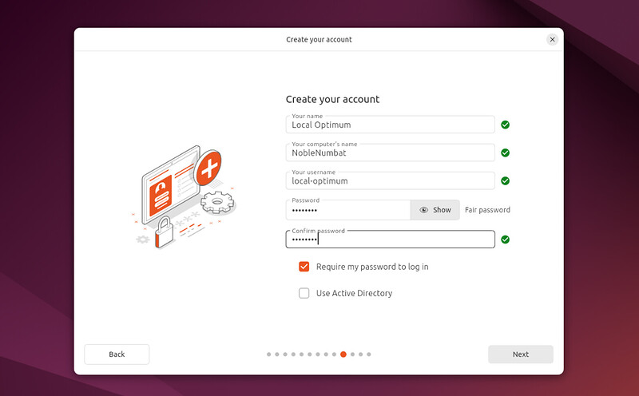

# 7. Create Your Login Detail

On this screen, you will be prompted to enter your name and the name of your computer as it will appear on the network. Finally, you will create a username and a strong password.

You can choose to log in automatically or require a password. If you are using your device whilst travelling, it’s recommended to keep “**Require my password to log in**” enabled.

