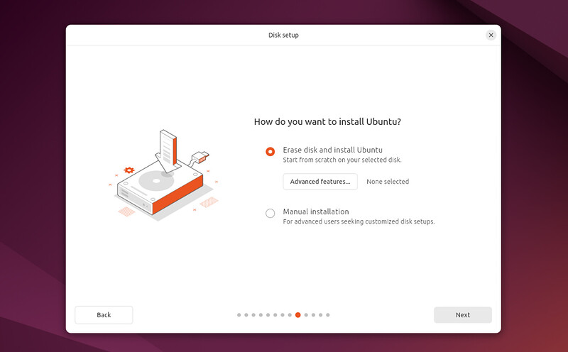

# 6. Type of Installation

This screen allows you to configure your installation. If you would like Ubuntu to be the only operating system on your hard drive, select **Erase disk and install Ubuntu**.

If your device currently has another operating system installed, you will receive additional options to install Ubuntu alongside that OS rather than replacing it.

