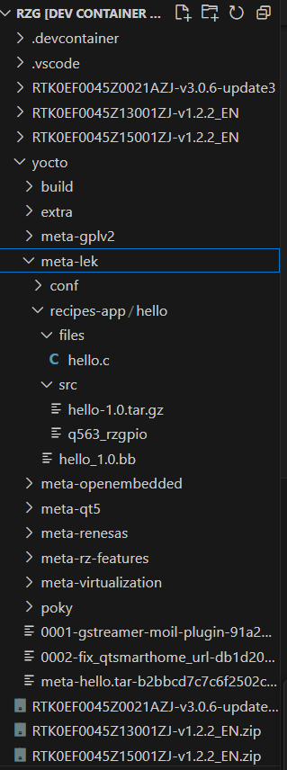

# 2. Create a Layer Folder

In this tutorial, we will prepare a simple hello.c program, it simply print out message on the screen. Prepare a .bb file describe the source file location, compile, link and install commands, The below tree shows an example folder structure of a layer.

```
meta-lek
├── conf
│   └── layer.conf
└── recipes-app
    └── hello
        ├── files
            ├── hello.c
        └── src             
            └── hello-1.0.tar.gz
            └── q563_rzgpio
        ├── hello_1.0.bb
```

